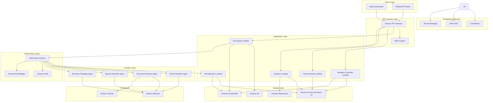
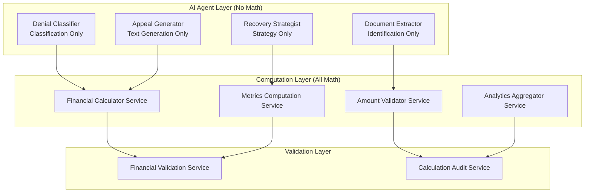
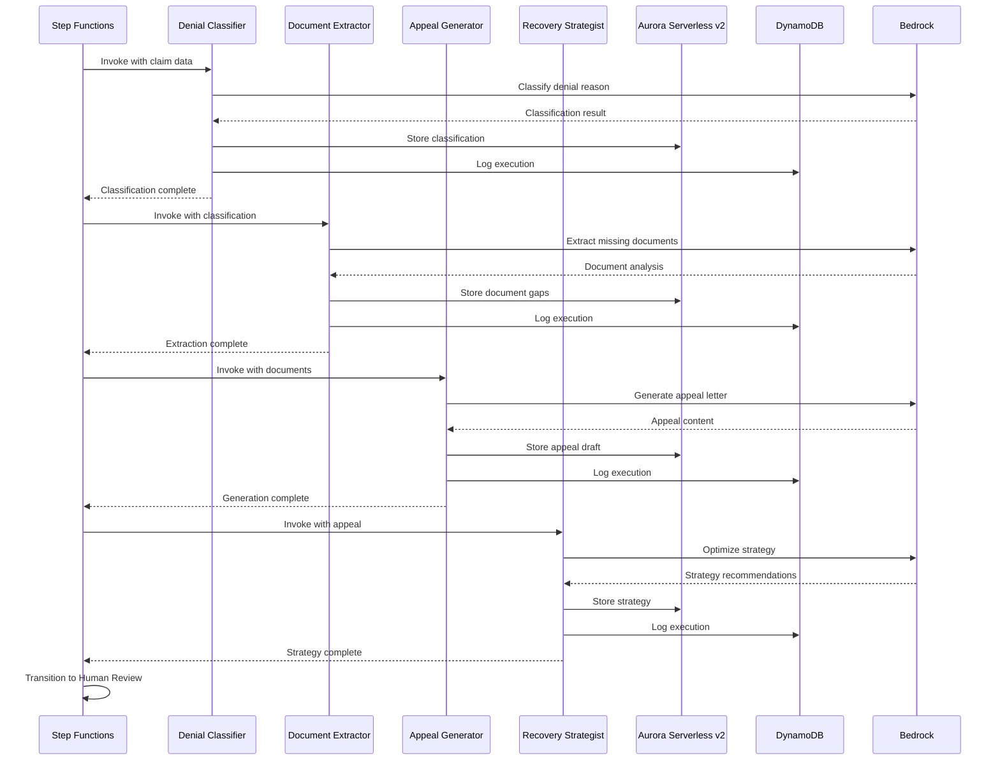
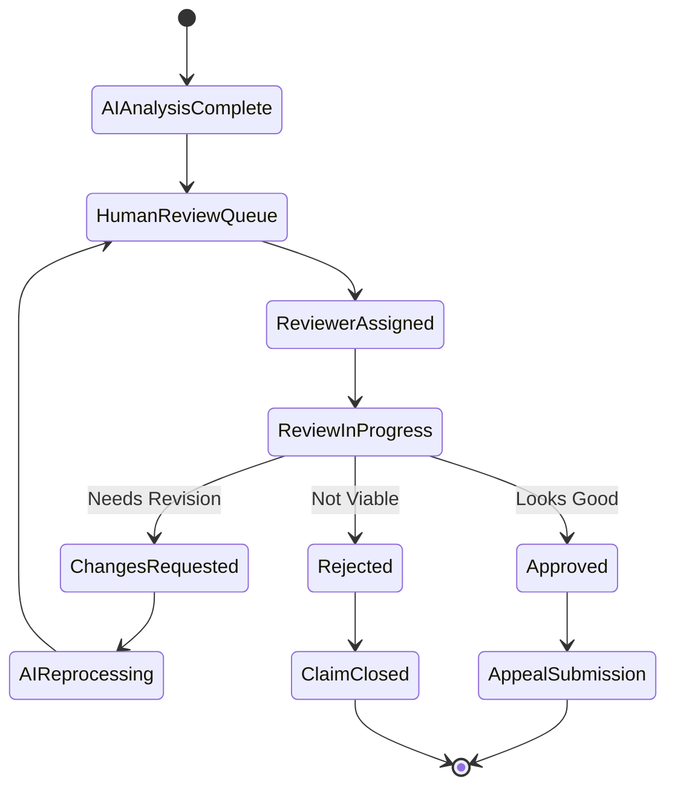

# ClaimIQ System Architecture Design

## Overview

ClaimIQ is an AI-powered Insurance Denial Recovery System built as a serverless-first, multi-tenant SaaS platform on AWS. The system processes denied insurance claims through a sophisticated workflow orchestrated by AWS Step Functions, leveraging four specialized AI agents powered by Amazon Bedrock to automate denial analysis, document extraction, appeal generation, and recovery strategy optimization.

The architecture follows event-driven patterns with human-in-the-loop controls at every financial decision point, ensuring hospitals maintain oversight while benefiting from AI automation. The system is designed to handle the specific workflows and challenges of Indian hospitals, supporting PDF, Excel, and CSV ingestion with multi-tenant data isolation.

## Design Principles

### KISS Principle (Keep It Simple, Stupid)
- **Simplicity First**: Every component serves a single, clear purpose
- **No Over-Engineering**: Avoid complex patterns unless absolutely necessary
- **Remove Unused Code**: Clean up immediately to prevent technical debt
- **Clear Interfaces**: Use TypeScript for explicit contracts between components
- **Readable Code**: Prioritize maintainability over cleverness

### TypeScript-First Development
- **Type Safety**: All Lambda functions written in TypeScript with strict mode
- **Better Developer Experience**: IDE support, autocomplete, and refactoring
- **Runtime Safety**: Catch errors at compile time, not in production
- **Clear Contracts**: Interfaces define data structures and API contracts
- **Maintainability**: Easier to understand and modify code over time

## Architecture

### High-Level System Architecture



### AWS Services Architecture

The system leverages the following AWS services with specific justifications:

**Compute Services:**
- **AWS Lambda**: All backend logic runs in Lambda functions for serverless scalability and cost optimization
- **AWS Step Functions**: Orchestrates the complex claim workflow state machine with built-in error handling and retry logic

**AI/ML Services:**
- **Amazon Bedrock**: Provides access to foundation models (Claude, Titan) for all AI agent operations
- **Amazon Textract**: Extracts text and structured data from PDF documents and scanned images

**Storage Services:**
- **Amazon S3**: Stores uploaded files, generated documents, and static assets with tenant-specific prefixes
- **Amazon Aurora Serverless v2 (PostgreSQL)**: Primary database for core business entities (Tenants, Hospitals, Claims, Denials, Appeals, Recoveries) with strong consistency and audit capabilities
- **Amazon DynamoDB**: Secondary datastore for operational data (agent execution logs, state machine checkpoints, idempotency keys, event sourcing)
- **Amazon ElastiCache**: Caches frequently accessed data like tenant configurations and AI model responses

**Integration Services:**
- **Amazon API Gateway**: Provides REST API endpoints with built-in throttling, authentication, and monitoring
- **Amazon SQS**: Handles asynchronous processing queues for file processing and AI agent tasks
- **Amazon EventBridge**: Routes events between services for loose coupling and event-driven architecture

**Security Services:**
- **AWS KMS**: Encrypts all data at rest with tenant-specific encryption keys
- **AWS Secrets Manager**: Stores API keys, database credentials, and other sensitive configuration
- **AWS IAM**: Provides fine-grained access control with least privilege principles

**Monitoring Services:**
- **Amazon CloudWatch**: Monitors system metrics, logs, and alarms for operational visibility

## Components and Interfaces

### 1. Ingestion Service

**Responsibility:** Generate pre-signed URLs for direct S3 uploads and handle upload lifecycle

**Implementation:** 
- Lambda function triggered by API Gateway
- Generates S3 pre-signed URLs for direct client uploads
- Creates initial claim records in Aurora Serverless v2 with UPLOAD_PENDING status
- Validates file metadata (size, type, tenant information)
- Supports duplicate detection via optional file hash
- Logs all pre-signed URL requests in DynamoDB for audit trail

**Key Interfaces:**
```typescript
interface PresignedUrlRequest {
  tenantId: string;
  hospitalId: string;
  filename: string;
  contentType: string;
  fileSize: number;
  fileHash?: string; // Optional for duplicate detection
}

interface PresignedUrlResponse {
  claimId: string;
  uploadId: string;
  presignedUrl: string;
  s3Bucket: string;
  s3Key: string;
  expiresIn: number;
  maxFileSize: number;
  status: 'ready_for_upload' | 'duplicate';
  message: string;
}
```

### 1.1. S3 Event Processor

**Responsibility:** Process S3 upload events and trigger claim processing workflow

**Implementation:**
- Lambda function triggered by S3 bucket events (ObjectCreated:*)
- Calculates file hash from uploaded S3 object
- Updates claim status from UPLOAD_PENDING to NEW
- Extracts metadata from S3 object tags
- Triggers Step Functions workflow for claim processing
- Handles processing errors and marks claims for manual review

**Key Interfaces:**
```typescript
interface S3ProcessorInput {
  Records: S3EventRecord[];
}

interface S3ProcessorOutput {
  claimId: string;
  status: 'processed' | 'error';
  workflowExecutionArn?: string;
  fileHash: string;
  error?: string;
}
```

### 2. Normalization Service

**Responsibility:** Convert raw data into structured entities

**Implementation:**
- Lambda function invoked by Step Functions
- Uses Amazon Textract for PDF text extraction
- Applies data validation and cleansing rules
- Creates normalized entities in Aurora Serverless v2
- Stores processing events and checkpoints in DynamoDB
- Handles duplicate detection and merging

**Key Interfaces:**
```typescript
interface NormalizationInput {
  claimId: string;
  s3Location: string;
  fileType: 'pdf' | 'excel' | 'csv';
}

interface NormalizedClaim {
  claimId: string;
  tenantId: string;
  hospitalId: string;
  patientInfo: PatientInfo;
  payerInfo: PayerInfo;
  denialInfo: DenialInfo;
  documents: DocumentInfo[];
}
```

### 3. Workflow Engine

**Responsibility:** Orchestrate claim processing through state machine

**Implementation:**
- AWS Step Functions state machine
- Manages state transitions: NEW → DENIED → AI_ANALYZED → HUMAN_REVIEW → SUBMITTED → RECOVERED/FAILED
- Implements SLA timers and retry logic
- Triggers appropriate Lambda functions for each state
- Maintains audit trail of all transitions

**State Machine Definition:**
```json
{
  "Comment": "ClaimIQ Workflow State Machine",
  "StartAt": "NormalizeClaim",
  "States": {
    "NormalizeClaim": {
      "Type": "Task",
      "Resource": "arn:aws:lambda:region:account:function:normalization-service",
      "Next": "ClassifyDenial"
    },
    "ClassifyDenial": {
      "Type": "Task",
      "Resource": "arn:aws:lambda:region:account:function:denial-classifier",
      "Next": "ExtractDocuments"
    },
    "ExtractDocuments": {
      "Type": "Task",
      "Resource": "arn:aws:lambda:region:account:function:document-extractor",
      "Next": "GenerateAppeal"
    },
    "GenerateAppeal": {
      "Type": "Task",
      "Resource": "arn:aws:lambda:region:account:function:appeal-generator",
      "Next": "StrategizeRecovery"
    },
    "StrategizeRecovery": {
      "Type": "Task",
      "Resource": "arn:aws:lambda:region:account:function:recovery-strategist",
      "Next": "HumanReview"
    },
    "HumanReview": {
      "Type": "Wait",
      "SecondsPath": "$.humanReviewTimeout",
      "Next": "CheckApproval"
    }
  }
}
```

### 4. AI Agent Core

**Responsibility:** Execute specialized AI tasks for claim processing

**Implementation:** Four Lambda functions, each implementing a specific AI agent:

#### Denial Classifier Agent
- Analyzes denial text using Bedrock Claude model
- Categorizes denial reasons (missing documents, coding errors, policy limits, etc.)
- Maintains classification confidence scores
- Stores reasoning and evidence for human review

#### Document Extractor Agent
- Uses Amazon Textract to extract text from PDFs
- Identifies missing required documents
- Extracts key fields (claim amounts, dates, codes)
- Validates document completeness against payer requirements

#### Appeal Generator Agent
- Creates formal appeal letters using Bedrock
- References Indian insurance regulations and payer-specific rules
- Includes medical justification and financial impact
- Generates letters in appropriate formal tone for Indian context

#### Recovery Strategist Agent
- Prioritizes claims by financial impact and recovery probability
- Suggests next best actions (document collection, escalation, write-off)
- Considers filing deadlines and payer response patterns
- Optimizes resource allocation across claim portfolio

**Common Agent Interface:**
```typescript
interface AgentInput {
  claimId: string;
  context: ClaimContext;
  previousActions: AgentAction[];
}

interface AgentOutput {
  agentId: string;
  action: string;
  reasoning: string;
  confidence: number;
  recommendations: string[];
  nextSteps: string[];
}
```

### 5. Human Review Interface

**Responsibility:** Enable human oversight and approval of AI actions

**Implementation:**
- React-based web dashboard
- Lambda functions for API endpoints
- Real-time updates via WebSocket (API Gateway WebSocket)
- Mobile-responsive design for billing staff

**Key Features:**
- Display AI analysis with explanations
- Edit appeal letters and recommendations
- Approve/reject actions with audit trail
- Priority queue based on financial impact
- Deadline tracking and alerts

### 6. Analytics Dashboard

**Responsibility:** Provide ROI metrics and performance insights

**Implementation:**
- Lambda functions for data aggregation
- ElastiCache for performance optimization
- Pre-computed metrics updated via EventBridge triggers
- Export capabilities to PDF/Excel

**Key Metrics:**
- Total denied amount
- Amount recovered
- Recovery percentage
- Days saved through automation
- AI vs human success rates
- Claim processing velocity

## Data Models

### Database Architecture Strategy

The ClaimIQ system uses a hybrid database approach optimized for different data patterns:

**Primary Database - Aurora Serverless v2 (PostgreSQL):**
- **Purpose:** System of record for all core business entities
- **Entities:** Tenants, Hospitals, Users, Claims, Denials, Appeals, Recoveries, Payments, Workflow state
- **Rationale:** 
  - Strong consistency required for financial workflows
  - ACID compliance for audit and compliance requirements
  - Complex queries for analytics and reporting
  - Mature ecosystem for HIPAA/SOC2 compliance
  - Automatic scaling with serverless v2

**Secondary Database - DynamoDB:**
- **Purpose:** High-volume operational and event data
- **Data Types:** Agent execution logs, state machine checkpoints, idempotency keys, event sourcing, system events
- **Rationale:**
  - High throughput for operational logging
  - Event sourcing patterns
  - Automatic scaling for variable workloads
  - Cost-effective for high-volume, low-complexity data

**Document Storage - S3:**
- **Purpose:** File and document storage
- **Content:** Claim PDFs, denial letters, medical documents, appeal files, OCR outputs
- **Rationale:**
  - Cost-effective for large file storage
  - Integrated with AWS AI services (Textract, Bedrock)
  - Tenant isolation through prefixes
  - Lifecycle management for archival

### Core Entities

```typescript
interface Tenant {
  tenantId: string;
  name: string;
  type: 'hospital' | 'billing_service';
  configuration: TenantConfig;
  createdAt: Date;
  updatedAt: Date;
}

interface Hospital {
  hospitalId: string;
  tenantId: string;
  name: string;
  address: Address;
  contactInfo: ContactInfo;
  payerContracts: PayerContract[];
}

interface Claim {
  claimId: string;
  tenantId: string;
  hospitalId: string;
  patientId: string;
  payerId: string;
  claimNumber: string;
  claimAmount: number;
  deniedAmount: number;
  submissionDate: Date;
  denialDate: Date;
  status: ClaimStatus;
  documents: DocumentReference[];
  auditTrail: AuditEntry[];
}

interface Denial {
  denialId: string;
  claimId: string;
  reason: DenialReason;
  denialCode: string;
  denialText: string;
  deniedAmount: number;
  appealDeadline: Date;
  classification: DenialClassification;
}

interface AgentAction {
  actionId: string;
  claimId: string;
  agentType: AgentType;
  action: string;
  input: any;
  output: any;
  reasoning: string;
  confidence: number;
  timestamp: Date;
  humanApproved: boolean;
}

interface Appeal {
  appealId: string;
  claimId: string;
  appealLetter: string;
  supportingDocuments: DocumentReference[];
  submissionDate: Date;
  status: AppealStatus;
  outcome: AppealOutcome;
  recoveredAmount?: number;
}
```

### Enums and Types

```typescript
enum ClaimStatus {
  NEW = 'NEW',
  DENIED = 'DENIED',
  AI_ANALYZED = 'AI_ANALYZED',
  HUMAN_REVIEW = 'HUMAN_REVIEW',
  SUBMITTED = 'SUBMITTED',
  RECOVERED = 'RECOVERED',
  FAILED = 'FAILED'
}

enum DenialReason {
  MISSING_DOCUMENTS = 'MISSING_DOCUMENTS',
  CODING_ERROR = 'CODING_ERROR',
  POLICY_LIMIT = 'POLICY_LIMIT',
  TIMELY_FILING = 'TIMELY_FILING',
  MEDICAL_NECESSITY = 'MEDICAL_NECESSITY',
  PRE_AUTH_REQUIRED = 'PRE_AUTH_REQUIRED'
}

enum AgentType {
  DENIAL_CLASSIFIER = 'DENIAL_CLASSIFIER',
  DOCUMENT_EXTRACTOR = 'DOCUMENT_EXTRACTOR',
  APPEAL_GENERATOR = 'APPEAL_GENERATOR',
  RECOVERY_STRATEGIST = 'RECOVERY_STRATEGIST'
}
```

## Denied Claim Flow

The complete flow of how a denied claim moves through the ClaimIQ system:

### 1. Ingestion Phase
1. Hospital billing staff uploads denied claim file (PDF/Excel/CSV) via web interface
2. API Gateway authenticates request and routes to File Upload Lambda
3. Lambda validates file format and size, stores in S3 with tenant prefix
4. Initial claim record created in Aurora Serverless v2 with status = NEW
5. Processing event logged in DynamoDB for operational tracking
5. Step Function workflow triggered with claim metadata

### 2. Normalization Phase
1. Step Function invokes Normalization Lambda
2. Lambda retrieves file from S3 and determines processing strategy
3. For PDFs: Amazon Textract extracts text and structured data
4. For Excel/CSV: Custom parsers extract structured data
5. Data validation and cleansing applied
6. Normalized entities (Claim, Denial, Patient, Payer) created in DynamoDB
7. Claim status updated to DENIED

### 3. AI Analysis Phase
1. **Denial Classifier Agent** (Lambda + Bedrock):
   - Analyzes denial text and categorizes reason
   - Assigns confidence score and detailed reasoning
   - Stores classification results in Aurora Serverless v2
   - Logs execution details in DynamoDB

2. **Document Extractor Agent** (Lambda + Textract + Bedrock):
   - Identifies missing required documents
   - Extracts key fields from available documents
   - Validates completeness against payer requirements
   - Creates document inventory and gap analysis

3. **Appeal Generator Agent** (Lambda + Bedrock):
   - Generates formal appeal letter with medical justification
   - References relevant insurance regulations and payer policies
   - Creates supporting argument based on denial reason
   - Formats letter according to Indian business communication standards

4. **Recovery Strategist Agent** (Lambda + Bedrock):
   - Calculates recovery probability based on historical data
   - Prioritizes claim based on financial impact and effort required
   - Suggests optimal next actions and timeline
   - Identifies escalation paths if initial appeal fails

5. Claim status updated to AI_ANALYZED

### 4. Human Review Phase
1. Claim appears in Human Review Interface priority queue
2. Billing staff reviews AI analysis, reasoning, and proposed actions
3. Staff can edit appeal letter, modify recommendations, or reject AI suggestions
4. All changes tracked in audit trail
5. Staff approves or rejects the proposed appeal
6. If approved: claim status updated to SUBMITTED
7. If rejected: claim returns to AI_ANALYZED for alternative approach

### 5. Submission and Tracking Phase
1. Approved appeals submitted to appropriate TPA/insurer portal
2. Submission confirmation stored with tracking numbers
3. Follow-up reminders scheduled based on payer response timelines
4. Status updates tracked: SUBMITTED → RECOVERED/FAILED
5. Financial outcomes recorded for ROI calculation

### 6. Analytics and Learning Phase
1. Recovery outcomes feed back into AI models for continuous improvement
2. Success patterns analyzed to optimize future recommendations
3. ROI metrics updated in real-time dashboards
4. Performance reports generated for hospital management

## Numerical Computation Architecture

### LLM vs Code Separation

**Critical Rule:** LLMs must NEVER perform arithmetic or financial calculations. All mathematical operations must be handled by deterministic code services.

**LLM Responsibilities (Classification & Reasoning Only):**
- Denial reason classification
- Document type identification
- Text extraction and understanding
- Medical necessity reasoning
- Appeal letter generation (text only)
- Explanation and justification

**Code Responsibilities (All Mathematics):**
- Financial calculations (totals, percentages, recoveries)
- Claim amount validations and adjustments
- Recovery probability calculations
- ROI and metrics computation
- Aggregations and analytics
- Performance metrics

### Architecture Implementation



### Financial Calculation Services

**1. Financial Calculator Service**
```typescript
interface FinancialCalculatorService {
  // Room rent calculations
  calculateRoomRentAdjustment(
    originalRate: number,
    days: number,
    policyLimit: number
  ): RoomRentCalculation;
  
  // Claim amount calculations
  calculateTotalClaimAmount(lineItems: LineItem[]): ClaimAmountCalculation;
  
  // Recovery calculations
  calculateRecoveryMetrics(
    originalAmount: number,
    recoveredAmount: number,
    processingCost: number
  ): RecoveryMetrics;
  
  // Percentage calculations
  calculateRecoveryPercentage(
    recoveredAmount: number,
    totalAmount: number
  ): number;
}
```

**2. Amount Validator Service**
```typescript
interface AmountValidatorService {
  // Validate claim amounts
  validateClaimAmounts(claim: ClaimData): ValidationResult;
  
  // Validate policy limits
  validatePolicyLimits(
    claimAmounts: ClaimAmounts,
    policyLimits: PolicyLimits
  ): PolicyValidationResult;
  
  // Cross-validate totals
  validateTotals(lineItems: LineItem[], total: number): boolean;
}
```

**3. Metrics Computation Service**
```typescript
interface MetricsComputationService {
  // ROI calculations
  calculateROI(netRecovery: number, processingCost: number): number;
  
  // Performance metrics
  calculatePerformanceMetrics(claims: ClaimData[]): PerformanceMetrics;
  
  // Analytics aggregations
  calculateAnalytics(
    timeRange: DateRange,
    tenantId: string
  ): AnalyticsResults;
}
```

### LLM Output Structure

All AI agents must output structured JSON with NO calculations:

```typescript
// CORRECT: LLM outputs classification only
interface DenialClassifierOutput {
  classification: {
    primaryCategory: string;
    confidence: number; // 0.0 to 1.0 (not calculated by LLM)
    reasoning: string;
  };
  identifiedIssues: {
    missingDocuments: string[];
    codingIssues: string[];
    policyViolations: string[]; // Description only, no amounts
  };
  // NO financial calculations here
}

// WRONG: LLM should never output calculated amounts
interface WrongOutput {
  calculatedTotal: number; // ❌ NEVER
  recoveryAmount: number; // ❌ NEVER
  adjustedAmount: number; // ❌ NEVER
}
```

### Calculation Validation Pipeline

```typescript
class CalculationValidationPipeline {
  async processClaimCalculations(
    aiOutput: AIAgentOutput,
    claimData: ClaimData
  ): Promise<ValidatedCalculations> {
    
    // 1. Extract non-numeric data from AI
    const classification = aiOutput.classification;
    const issues = aiOutput.identifiedIssues;
    
    // 2. Perform all calculations in code
    const calculations = await this.financialCalculator.calculateAll({
      originalAmount: claimData.totalAmount,
      lineItems: claimData.lineItems,
      policyLimits: claimData.policyLimits,
      adjustments: this.deriveAdjustments(issues)
    });
    
    // 3. Validate calculations
    const validation = await this.validator.validate(calculations);
    if (!validation.isValid) {
      throw new CalculationError(validation.errors);
    }
    
    // 4. Audit trail
    await this.auditService.logCalculations({
      claimId: claimData.claimId,
      calculations,
      validation,
      timestamp: new Date()
    });
    
    return {
      aiClassification: classification,
      calculatedAmounts: calculations,
      validationResult: validation
    };
  }
}
```

## AI Agent Placement in Architecture

### Deployment Architecture

Each AI agent runs as a dedicated AWS Lambda function with the following specifications:

**Denial Classifier Agent:**
- **Runtime:** Python 3.11
- **Memory:** 1024 MB
- **Timeout:** 5 minutes
- **Bedrock Model:** Claude-3 Haiku for fast classification
- **Triggers:** Step Functions, SQS for batch processing
- **Storage:** Classification results in Aurora Serverless v2, execution logs in DynamoDB

**Document Extractor Agent:**
- **Runtime:** Python 3.11
- **Memory:** 2048 MB (higher for document processing)
- **Timeout:** 10 minutes
- **Services:** Amazon Textract + Bedrock Claude-3 Sonnet
- **Triggers:** Step Functions after classification
- **Storage:** Extracted data in Aurora Serverless v2, execution logs in DynamoDB, processed documents in S3

**Appeal Generator Agent:**
- **Runtime:** Python 3.11
- **Memory:** 1536 MB
- **Timeout:** 8 minutes
- **Bedrock Model:** Claude-3 Sonnet for complex text generation
- **Triggers:** Step Functions after document extraction
- **Storage:** Appeal metadata in Aurora Serverless v2, execution logs in DynamoDB, generated appeals in S3

**Recovery Strategist Agent:**
- **Runtime:** Python 3.11
- **Memory:** 1024 MB
- **Timeout:** 5 minutes
- **Bedrock Model:** Claude-3 Haiku for strategy optimization
- **Triggers:** Step Functions after appeal generation
- **Storage:** Strategy recommendations in Aurora Serverless v2, execution logs in DynamoDB

### Agent Coordination



### Agent Memory and Context Management

Each agent maintains context through:

1. **Claim Context Store (Aurora Serverless v2):**
   - Core business entities and relationships
   - Persistent memory across agent invocations
   - Strong consistency for financial data

2. **Agent Execution Logs (DynamoDB):**
   - High-volume operational data
   - Agent execution traces and performance metrics
   - Idempotency keys and checkpoints

3. **Shared Knowledge Base (S3 + Aurora Serverless v2):**
   - Payer-specific rules and requirements stored in Aurora
   - Historical success patterns and analytics
   - Template libraries and documents stored in S3

## Human-in-the-loop Implementation

### Integration Points

Human oversight is integrated at multiple levels throughout the system:

### 1. Pre-Processing Review
- **Trigger:** After file upload and normalization
- **Interface:** File validation dashboard
- **Actions:** Approve/reject normalized data, correct extraction errors
- **Mandatory:** No - automated processing continues unless flagged

### 2. AI Analysis Review
- **Trigger:** After all four AI agents complete analysis
- **Interface:** AI Analysis Review Dashboard
- **Actions:** Review classifications, edit recommendations, approve/reject analysis
- **Mandatory:** Yes - no appeals generated without human review

### 3. Appeal Approval
- **Trigger:** After appeal letter generation
- **Interface:** Appeal Review and Edit Interface
- **Actions:** Edit appeal content, approve submission, request revisions
- **Mandatory:** Yes - no appeals submitted without explicit approval

### 4. Financial Decision Points
- **Trigger:** Any action involving money (write-offs, settlements)
- **Interface:** Financial Decision Dashboard
- **Actions:** Approve/reject financial recommendations with justification
- **Mandatory:** Yes - all financial decisions require human authorization

### Human Review Interface Components

```typescript
interface HumanReviewDashboard {
  // Priority queue of claims requiring review
  pendingReviews: ClaimReview[];
  
  // Financial impact summary
  financialSummary: {
    totalAtRisk: number;
    potentialRecovery: number;
    deadlineAlerts: number;
  };
  
  // Quick action buttons
  bulkActions: BulkAction[];
  
  // Performance metrics
  userMetrics: ReviewerMetrics;
}

interface ClaimReview {
  claimId: string;
  priority: 'HIGH' | 'MEDIUM' | 'LOW';
  deniedAmount: number;
  daysUntilDeadline: number;
  aiRecommendation: string;
  aiConfidence: number;
  requiredActions: ReviewAction[];
}

interface ReviewAction {
  type: 'APPROVE' | 'EDIT' | 'REJECT' | 'REQUEST_INFO';
  component: 'CLASSIFICATION' | 'APPEAL' | 'STRATEGY';
  description: string;
  impact: string;
}
```

### Approval Workflow



### Human Override Capabilities

The system provides comprehensive override capabilities:

1. **AI Decision Override:**
   - Humans can override any AI classification or recommendation
   - Override reasons captured for system learning
   - Alternative actions can be specified

2. **Appeal Content Override:**
   - Complete editing of AI-generated appeal letters
   - Template library for common modifications
   - Version control for appeal iterations

3. **Strategy Override:**
   - Modify AI-suggested priorities and timelines
   - Override recovery probability assessments
   - Specify alternative escalation paths

4. **Workflow Override:**
   - Skip AI analysis for urgent claims
   - Fast-track high-value claims
   - Batch process similar claims

### Audit and Compliance

All human interactions are fully audited:

```typescript
interface HumanAction {
  actionId: string;
  userId: string;
  claimId: string;
  actionType: HumanActionType;
  originalAIRecommendation: any;
  humanDecision: any;
  reasoning: string;
  timestamp: Date;
  ipAddress: string;
  sessionId: string;
}

enum HumanActionType {
  APPROVE_CLASSIFICATION = 'APPROVE_CLASSIFICATION',
  EDIT_APPEAL = 'EDIT_APPEAL',
  OVERRIDE_STRATEGY = 'OVERRIDE_STRATEGY',
  APPROVE_SUBMISSION = 'APPROVE_SUBMISSION',
  REJECT_CLAIM = 'REJECT_CLAIM',
  REQUEST_REVISION = 'REQUEST_REVISION'
}
```

This comprehensive human-in-the-loop implementation ensures that while AI provides intelligent automation and recommendations, humans maintain complete control over all financial decisions and can override any system recommendation based on their expertise and judgment.

## Correctness Properties

*A property is a characteristic or behavior that should hold true across all valid executions of a system—essentially, a formal statement about what the system should do. Properties serve as the bridge between human-readable specifications and machine-verifiable correctness guarantees.*

### Property Reflection

After analyzing all acceptance criteria, several properties can be consolidated to eliminate redundancy:

- File upload properties (1.1, 1.2, 1.3) can be combined into a single comprehensive file handling property
- State transition properties (3.1-3.6) can be consolidated into workflow state machine correctness
- Multi-tenant isolation properties (6.1-6.5) can be unified into comprehensive tenant isolation
- Analytics calculation properties (7.1-7.5) can be combined into analytics correctness

### Core System Properties

**Property 1: File Upload and Storage Consistency**
*For any* valid file upload (PDF, Excel, or CSV under 50MB), the system should store the file in S3 with proper tenant prefix, create corresponding database records, and maintain audit logs with timestamps and user information
**Validates: Requirements 1.1, 1.2, 1.3, 1.7**

**Property 2: Duplicate Detection and Prevention**
*For any* file that has been previously uploaded, subsequent uploads of the same file should be detected as duplicates and prevent reprocessing while maintaining the original processing record
**Validates: Requirements 1.5**

**Property 3: Entity Creation Completeness**
*For any* raw claim data processed by the normalization service, all required entities (Tenant, Hospital, Claim, Denial, Patient, Payer) should be created with valid tenantId fields and proper data validation
**Validates: Requirements 2.1, 2.2, 2.4**

**Property 4: Error Handling and Manual Review Flagging**
*For any* data processing operation that fails due to malformed input or validation errors, the system should log the error with detailed information and mark the record for manual review
**Validates: Requirements 2.3**

**Property 5: Workflow State Machine Correctness**
*For any* claim in the system, state transitions should follow the defined sequence (NEW → DENIED → AI_ANALYZED → HUMAN_REVIEW → SUBMITTED → RECOVERED/FAILED) with proper audit logging and SLA timer management
**Validates: Requirements 3.1, 3.2, 3.3, 3.4, 3.5, 3.6, 3.7, 3.8**

**Property 6: AI Agent Processing Chain**
*For any* claim entering the DENIED state, all four AI agents (Denial Classifier, Document Extractor, Appeal Generator, Recovery Strategist) should execute in sequence, maintain context across invocations, and produce auditable outputs with reasoning explanations
**Validates: Requirements 4.1, 4.2, 4.3, 4.4, 4.5, 4.6**

**Property 7: AI Error Handling and Escalation**
*For any* AI agent operation that fails or produces low-confidence results, the system should log the error, preserve the failure context, and escalate the claim to human review with appropriate error information
**Validates: Requirements 4.7**

**Property 8: Human Review Interface Completeness**
*For any* claim in HUMAN_REVIEW state, the interface should display all AI analysis results, reasoning, proposed actions, and provide editing capabilities for appeal content while maintaining complete audit trails
**Validates: Requirements 5.1, 5.2, 5.3, 5.4, 5.7**

**Property 9: Financial Action Authorization**
*For any* action involving financial decisions (appeal submissions, write-offs, settlements), the system should prevent execution without explicit human approval and maintain detailed authorization records
**Validates: Requirements 5.5**

**Property 10: Multi-Tenant Data Isolation**
*For any* data operation (storage, retrieval, processing), the system should enforce tenant isolation by including tenantId in all records, filtering queries by tenant, using tenant-specific storage prefixes, and preventing cross-tenant data access
**Validates: Requirements 6.1, 6.2, 6.3, 6.4**

**Property 11: Analytics Calculation Accuracy**
*For any* analytics dashboard query, the displayed metrics (total denied amount, recovered amount, recovery percentage, days saved) should accurately reflect the underlying claim data and be properly filtered by tenant and date ranges
**Validates: Requirements 7.1, 7.2, 7.3, 7.4, 7.6**

**Property 12: Security and Encryption Compliance**
*For any* data stored or transmitted by the system, encryption should be applied using AWS KMS for data at rest and TLS 1.2+ for data in transit, with secrets stored in AWS Secrets Manager and proper IAM role-based access control
**Validates: Requirements 9.1, 9.2, 9.3, 9.4**

**Property 13: Audit Logging Completeness**
*For any* system operation (API calls, data access, state changes, user actions), comprehensive audit logs should be created with timestamps, user identity, operation details, and results
**Validates: Requirements 9.5**

**Property 14: Performance and Scalability Requirements**
*For any* system operation, performance should meet defined SLAs (file processing under 30 seconds for <10MB files, AI analysis under 2 minutes, concurrent processing up to 100 claims per tenant) with proper auto-scaling and circuit breaker protection
**Validates: Requirements 10.1, 10.2, 10.3, 10.5, 10.6**

**Property 15: Caching and Performance Optimization**
*For any* frequently accessed data (tenant configurations, AI model responses, analytics results), the system should implement caching mechanisms that improve response times while maintaining data consistency
**Validates: Requirements 10.7**

## Error Handling

### Error Categories and Responses

**File Processing Errors:**
- **Invalid file format:** Return descriptive error message, log attempt, do not create processing record
- **File size exceeded:** Return size limit error, suggest file compression or splitting
- **Corrupted files:** Log error details, mark for manual review, notify user
- **Storage failures:** Implement retry logic with exponential backoff, escalate after 3 attempts

**AI Agent Errors:**
- **Model unavailable:** Implement circuit breaker, fallback to cached responses or manual review
- **Low confidence results:** Flag for human review with confidence scores and reasoning
- **Tool calling failures:** Retry with alternative tools, log failures, escalate if persistent
- **Context memory issues:** Rebuild context from audit trail, continue processing

**Workflow Engine Errors:**
- **State transition failures:** Rollback to previous state, log error, trigger manual intervention
- **SLA timer failures:** Implement redundant timer mechanisms, escalate immediately
- **Concurrency conflicts:** Implement optimistic locking, retry with backoff

**Multi-Tenant Errors:**
- **Cross-tenant access attempts:** Block immediately, log security event, alert administrators
- **Tenant configuration errors:** Use default configurations, log for correction
- **Data isolation failures:** Halt processing, trigger security review

**External Integration Errors:**
- **TPA portal failures:** Queue for retry, implement alternative submission methods
- **Payment gateway errors:** Retry with exponential backoff, escalate to manual processing
- **Third-party API failures:** Implement circuit breakers, use cached data when available

### Error Recovery Strategies

**Automatic Recovery:**
- Retry transient failures up to 3 times with exponential backoff
- Use cached data for non-critical operations during outages
- Implement graceful degradation for non-essential features

**Manual Intervention:**
- Escalate persistent failures to human operators
- Provide detailed error context and suggested remediation
- Maintain error queues for batch processing during recovery

**System Protection:**
- Implement circuit breakers for external dependencies
- Use bulkhead patterns to isolate failure domains
- Monitor error rates and trigger alerts for anomalies

## Testing Strategy

### Dual Testing Approach

The ClaimIQ system requires comprehensive testing using both unit tests and property-based tests to ensure correctness across all scenarios:

**Unit Tests:**
- Focus on specific examples and edge cases
- Test integration points between AWS services
- Validate error conditions and boundary cases
- Test human interface workflows and approval processes
- Verify multi-tenant data isolation with specific tenant scenarios

**Property-Based Tests:**
- Verify universal properties across all inputs using randomized test data
- Test file processing with generated files of various formats and sizes
- Validate AI agent behavior across diverse claim scenarios
- Test workflow state transitions with random state sequences
- Verify analytics calculations with generated claim datasets

### Property-Based Testing Configuration

**Testing Framework:** Use Hypothesis (Python) or fast-check (TypeScript/JavaScript) for property-based testing
**Test Iterations:** Minimum 100 iterations per property test to ensure comprehensive coverage
**Test Data Generation:** 
- Generate realistic claim data with Indian hospital context
- Create diverse file formats (PDF, Excel, CSV) with varying structures
- Generate edge cases (empty files, malformed data, extreme values)
- Simulate various denial reasons and payer responses

**Property Test Tags:**
Each property-based test must include a comment referencing the design document property:

```python
# Feature: claimiq-system-architecture, Property 1: File Upload and Storage Consistency
def test_file_upload_storage_consistency(file_data, tenant_id):
    # Test implementation
```

**Integration with AWS Services:**
- Use LocalStack or AWS SAM Local for testing AWS service integrations
- Mock external APIs (Bedrock, Textract) for consistent test execution
- Test IAM permissions and security controls in isolated environments

### Test Coverage Requirements

**Functional Coverage:**
- All 15 correctness properties must have corresponding property-based tests
- Critical user workflows must have end-to-end integration tests
- Error handling paths must be tested with fault injection

**Performance Coverage:**
- Load testing for concurrent claim processing
- Performance testing for file upload and AI processing times
- Scalability testing for multi-tenant scenarios

**Security Coverage:**
- Penetration testing for multi-tenant isolation
- Security scanning for dependency vulnerabilities
- Compliance testing for HIPAA and data protection requirements

This comprehensive testing strategy ensures that ClaimIQ meets all functional, performance, and security requirements while maintaining the reliability needed for production hospital billing operations.