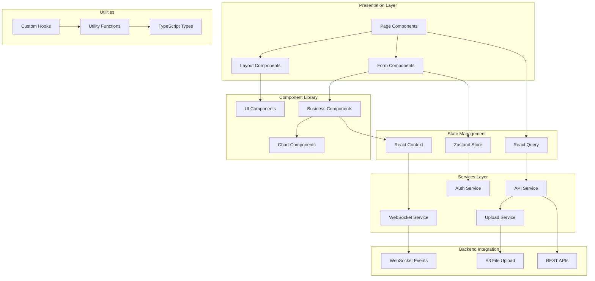
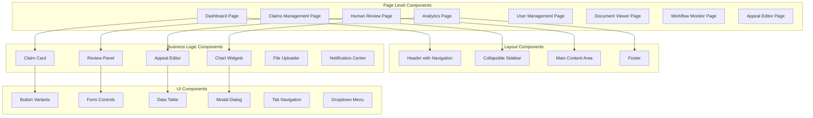

# ClaimIQ UI Enhancement Design

## Overview

The ClaimIQ UI Enhancement transforms the existing basic React frontend into a comprehensive, enterprise-grade interface for the AI-powered Insurance Denial Recovery System. The enhanced UI provides complete coverage of all human-in-the-loop workflows, administrative functions, and analytics capabilities required for effective claim denial recovery management.

Built on the existing React 18 + TypeScript + Vite foundation, the enhanced UI leverages modern web technologies including React Query for state management, WebSocket connections for real-time updates, and a comprehensive component library for consistent user experience. The design follows mobile-first responsive principles while maintaining the multi-tenant security architecture required for the SaaS platform.

The interface serves multiple user roles across Indian hospitals and billing service companies, providing role-based access to features ranging from basic claim processing to advanced analytics and system administration.

## Architecture

### High-Level UI Architecture



### Technology Stack Enhancement

**Core Technologies (Existing):**
- React 18 with TypeScript
- Vite for build tooling
- Tailwind CSS for styling
- React Router v6 for routing
- Axios for HTTP requests

**New Additions:**
- **React Query (TanStack Query)**: Advanced state management, caching, and synchronization
- **Zustand**: Lightweight state management for UI state
- **React Hook Form**: Efficient form handling with validation
- **Recharts**: Data visualization and analytics charts
- **React Virtual**: Virtual scrolling for large datasets
- **Socket.io Client**: Real-time WebSocket communication
- **React PDF**: PDF viewing and annotation
- **React DnD**: Advanced drag-and-drop functionality
- **Framer Motion**: Smooth animations and transitions
- **React Hot Toast**: Toast notifications
- **Date-fns**: Date manipulation and formatting

### Component Architecture



## Components and Interfaces

### 1. Enhanced Dashboard Interface

**Responsibility:** Provide comprehensive overview of system status, key metrics, and quick access to critical functions

**Key Features:**
- Real-time KPI widgets with auto-refresh
- Interactive charts showing trends and patterns
- Quick action buttons for common tasks
- Recent activity feed with filtering
- Customizable widget layout per user role
- Mobile-responsive card layout

**Component Structure:**
```typescript
interface DashboardProps {
  userRole: UserRole;
  tenantId: string;
  customLayout?: WidgetLayout;
}

interface DashboardWidget {
  id: string;
  type: 'kpi' | 'chart' | 'list' | 'action';
  title: string;
  size: 'small' | 'medium' | 'large';
  refreshInterval?: number;
  permissions: string[];
}

interface KPIWidget {
  value: number;
  label: string;
  trend: 'up' | 'down' | 'stable';
  trendValue: number;
  format: 'currency' | 'percentage' | 'number';
  color: 'primary' | 'success' | 'warning' | 'error';
}
```

### 2. Claims Management Interface

**Responsibility:** Comprehensive CRUD operations for claims with advanced filtering, search, and bulk operations

**Key Features:**
- Advanced data table with virtual scrolling
- Multi-column sorting and filtering
- Bulk selection and operations
- Inline editing for status updates
- Export functionality with custom field selection
- Real-time status updates via WebSocket

**Component Structure:**
```typescript
interface ClaimsTableProps {
  filters: ClaimFilters;
  sortConfig: SortConfig;
  selectedClaims: string[];
  onSelectionChange: (claimIds: string[]) => void;
  onBulkAction: (action: BulkAction, claimIds: string[]) => void;
}

interface ClaimFilters {
  status?: ClaimStatus[];
  dateRange?: DateRange;
  payerIds?: string[];
  hospitalIds?: string[];
  amountRange?: AmountRange;
  searchQuery?: string;
}

interface BulkAction {
  type: 'status_update' | 'assign_reviewer' | 'export' | 'delete';
  payload: any;
  confirmationRequired: boolean;
}
```

### 3. Human Review Interface

**Responsibility:** Comprehensive review and approval interface for AI analysis and recommendations

**Key Features:**
- Split-pane layout with claim details and review panel
- AI analysis visualization with confidence indicators
- Side-by-side document comparison
- Inline editing for appeal letters
- Approval workflow with digital signatures
- Comment threads for collaborative review

**Component Structure:**
```typescript
interface ReviewInterfaceProps {
  claimId: string;
  reviewType: 'classification' | 'extraction' | 'appeal' | 'strategy';
  aiAnalysis: AIAnalysisResult;
  onApprove: (decision: ApprovalDecision) => void;
  onReject: (reason: string, alternatives?: string[]) => void;
}

interface AIAnalysisResult {
  agentType: AgentType;
  confidence: number;
  reasoning: string;
  recommendations: Recommendation[];
  supportingEvidence: Evidence[];
  alternativeOptions: Alternative[];
}

interface ApprovalDecision {
  approved: boolean;
  modifications?: Modification[];
  comments?: string;
  nextActions?: string[];
}
```

### 4. Analytics Dashboard

**Responsibility:** Advanced analytics, reporting, and business intelligence interface

**Key Features:**
- Interactive charts with drill-down capabilities
- Customizable date ranges and filters
- Export to PDF and Excel with charts
- Predictive analytics visualization
- Comparative analysis tools
- Real-time metric updates

**Component Structure:**
```typescript
interface AnalyticsDashboardProps {
  dateRange: DateRange;
  filters: AnalyticsFilters;
  chartConfigs: ChartConfig[];
  exportOptions: ExportOption[];
}

interface ChartConfig {
  type: 'line' | 'bar' | 'pie' | 'area' | 'scatter';
  dataSource: string;
  xAxis: string;
  yAxis: string[];
  groupBy?: string;
  aggregation: 'sum' | 'avg' | 'count' | 'max' | 'min';
}

interface AnalyticsMetric {
  id: string;
  name: string;
  value: number;
  previousValue?: number;
  trend: TrendDirection;
  format: MetricFormat;
  drillDownAvailable: boolean;
}
```

### 5. Document Management Interface

**Responsibility:** Comprehensive document viewing, annotation, and management system

**Key Features:**
- PDF viewer with zoom, search, and annotation
- Document comparison side-by-side
- Version history and rollback
- Batch document operations
- OCR result overlay and editing
- Secure document sharing

**Component Structure:**
```typescript
interface DocumentViewerProps {
  documentId: string;
  documentType: 'original' | 'processed' | 'appeal' | 'response';
  annotations?: Annotation[];
  comparisonDocument?: string;
  onAnnotationAdd: (annotation: Annotation) => void;
  onDocumentUpdate: (updates: DocumentUpdate) => void;
}

interface Annotation {
  id: string;
  type: 'highlight' | 'note' | 'correction';
  position: Position;
  content: string;
  author: string;
  timestamp: Date;
}

interface DocumentUpdate {
  type: 'metadata' | 'content' | 'status';
  changes: Record<string, any>;
  reason?: string;
}
```

### 6. Workflow Monitoring Interface

**Responsibility:** Real-time workflow visualization and monitoring with SLA tracking

**Key Features:**
- Interactive workflow diagram
- Real-time status updates
- SLA countdown timers
- Bottleneck identification
- Performance metrics visualization
- Alert management interface

**Component Structure:**
```typescript
interface WorkflowMonitorProps {
  workflowType: 'claim_processing' | 'appeal_generation' | 'recovery';
  realTimeUpdates: boolean;
  slaTracking: boolean;
  alertThresholds: AlertThreshold[];
}

interface WorkflowStage {
  id: string;
  name: string;
  status: 'idle' | 'processing' | 'completed' | 'error';
  queueSize: number;
  averageProcessingTime: number;
  slaTarget: number;
  currentSlaStatus: 'on_track' | 'at_risk' | 'violated';
}

interface AlertThreshold {
  metric: string;
  operator: 'gt' | 'lt' | 'eq';
  value: number;
  severity: 'info' | 'warning' | 'error' | 'critical';
}
```

### 7. User Management Interface

**Responsibility:** Multi-tenant user administration with role-based access control

**Key Features:**
- User CRUD operations with tenant isolation
- Role assignment and permission management
- Bulk user operations and imports
- Activity monitoring and audit logs
- Session management and security controls
- Hospital hierarchy management

**Component Structure:**
```typescript
interface UserManagementProps {
  tenantId: string;
  currentUserRole: UserRole;
  hospitalHierarchy: HospitalNode[];
  permissionMatrix: PermissionMatrix;
}

interface UserProfile {
  id: string;
  email: string;
  name: string;
  role: UserRole;
  tenantId: string;
  hospitalIds: string[];
  permissions: Permission[];
  status: 'active' | 'inactive' | 'suspended';
  lastLogin?: Date;
  createdAt: Date;
}

interface PermissionMatrix {
  [role: string]: {
    [resource: string]: Permission[];
  };
}
```

## Data Models

### Enhanced Type Definitions

```typescript
// Enhanced Claim Types
interface EnhancedClaim extends Claim {
  aiAnalysis?: AIAnalysisResult;
  reviewHistory: ReviewAction[];
  documents: DocumentReference[];
  timeline: TimelineEvent[];
  slaStatus: SLAStatus;
  assignedReviewer?: string;
  priority: 'low' | 'medium' | 'high' | 'urgent';
  tags: string[];
}

// AI Analysis Results
interface AIAnalysisResult {
  denialClassification: DenialClassification;
  documentExtraction: DocumentExtraction;
  appealGeneration: AppealGeneration;
  recoveryStrategy: RecoveryStrategy;
  overallConfidence: number;
  processingTime: number;
  timestamp: Date;
}

interface DenialClassification {
  primaryReason: DenialReason;
  secondaryReasons: DenialReason[];
  confidence: number;
  reasoning: string;
  suggestedActions: string[];
  historicalPatterns: Pattern[];
}

interface DocumentExtraction {
  extractedFields: ExtractedField[];
  missingDocuments: MissingDocument[];
  documentQuality: DocumentQuality;
  ocrConfidence: number;
  validationResults: ValidationResult[];
}

interface AppealGeneration {
  appealLetter: string;
  supportingArguments: Argument[];
  legalReferences: LegalReference[];
  medicalJustification: string;
  estimatedSuccessRate: number;
  alternativeApproaches: Alternative[];
}

interface RecoveryStrategy {
  priorityScore: number;
  recommendedActions: Action[];
  timeline: Timeline;
  resourceRequirements: Resource[];
  riskAssessment: RiskAssessment;
  successProbability: number;
}

// User Interface Types
interface UserRole {
  id: string;
  name: string;
  permissions: Permission[];
  hierarchy: number;
  tenantSpecific: boolean;
}

interface Permission {
  resource: string;
  actions: ('create' | 'read' | 'update' | 'delete' | 'approve')[];
  conditions?: PermissionCondition[];
}

interface PermissionCondition {
  field: string;
  operator: 'eq' | 'in' | 'contains';
  value: any;
}

// Analytics Types
interface AnalyticsData {
  metrics: Metric[];
  trends: Trend[];
  comparisons: Comparison[];
  predictions: Prediction[];
  benchmarks: Benchmark[];
}

interface Metric {
  id: string;
  name: string;
  value: number;
  unit: string;
  format: 'currency' | 'percentage' | 'number' | 'duration';
  trend: TrendDirection;
  changeValue: number;
  changePercentage: number;
}

// Workflow Types
interface WorkflowState {
  claimId: string;
  currentStage: WorkflowStage;
  stageHistory: StageTransition[];
  slaStatus: SLAStatus;
  blockers: Blocker[];
  estimatedCompletion: Date;
}

interface SLAStatus {
  target: number;
  elapsed: number;
  remaining: number;
  status: 'on_track' | 'at_risk' | 'violated';
  escalationLevel: number;
}

// Notification Types
interface Notification {
  id: string;
  type: NotificationType;
  title: string;
  message: string;
  severity: 'info' | 'warning' | 'error' | 'success';
  timestamp: Date;
  read: boolean;
  actionRequired: boolean;
  relatedEntity?: EntityReference;
  expiresAt?: Date;
}

interface NotificationType {
  category: 'claim' | 'system' | 'user' | 'workflow';
  subcategory: string;
  priority: number;
  autoExpire: boolean;
  requiresAcknowledgment: boolean;
}
```

## User Interface Design

### Design System Enhancement

**Color Palette:**
```css
:root {
  /* Primary Colors - Blue palette for main actions */
  --primary-50: #eff6ff;
  --primary-100: #dbeafe;
  --primary-500: #3b82f6;
  --primary-600: #2563eb;
  --primary-700: #1d4ed8;
  
  /* Secondary Colors - Gray palette for text and backgrounds */
  --secondary-50: #f8fafc;
  --secondary-100: #f1f5f9;
  --secondary-500: #64748b;
  --secondary-600: #475569;
  --secondary-900: #0f172a;
  
  /* Status Colors */
  --success-50: #f0fdf4;
  --success-500: #22c55e;
  --success-600: #16a34a;
  
  --warning-50: #fffbeb;
  --warning-500: #f59e0b;
  --warning-600: #d97706;
  
  --error-50: #fef2f2;
  --error-500: #ef4444;
  --error-600: #dc2626;
}
```

**Typography Scale:**
```css
.text-xs { font-size: 0.75rem; line-height: 1rem; }
.text-sm { font-size: 0.875rem; line-height: 1.25rem; }
.text-base { font-size: 1rem; line-height: 1.5rem; }
.text-lg { font-size: 1.125rem; line-height: 1.75rem; }
.text-xl { font-size: 1.25rem; line-height: 1.75rem; }
.text-2xl { font-size: 1.5rem; line-height: 2rem; }
.text-3xl { font-size: 1.875rem; line-height: 2.25rem; }
```

**Spacing System:**
```css
.space-1 { margin: 0.25rem; }
.space-2 { margin: 0.5rem; }
.space-3 { margin: 0.75rem; }
.space-4 { margin: 1rem; }
.space-6 { margin: 1.5rem; }
.space-8 { margin: 2rem; }
```

### Layout Patterns

**Main Application Layout:**
```typescript
interface AppLayoutProps {
  children: React.ReactNode;
  user: User;
  sidebarCollapsed?: boolean;
  notifications: Notification[];
}

const AppLayout: React.FC<AppLayoutProps> = ({
  children,
  user,
  sidebarCollapsed = false,
  notifications
}) => {
  return (
    <div className="min-h-screen bg-secondary-50">
      <Header user={user} notifications={notifications} />
      <div className="flex">
        <Sidebar collapsed={sidebarCollapsed} userRole={user.role} />
        <main className="flex-1 p-6">
          {children}
        </main>
      </div>
    </div>
  );
};
```

**Page Layout Pattern:**
```typescript
interface PageLayoutProps {
  title: string;
  subtitle?: string;
  actions?: React.ReactNode;
  tabs?: TabConfig[];
  children: React.ReactNode;
}

const PageLayout: React.FC<PageLayoutProps> = ({
  title,
  subtitle,
  actions,
  tabs,
  children
}) => {
  return (
    <div className="space-y-6">
      <div className="flex items-center justify-between">
        <div>
          <h1 className="text-3xl font-bold text-secondary-900">{title}</h1>
          {subtitle && (
            <p className="text-secondary-600 mt-1">{subtitle}</p>
          )}
        </div>
        {actions && <div className="flex space-x-3">{actions}</div>}
      </div>
      
      {tabs && <TabNavigation tabs={tabs} />}
      
      <div className="space-y-6">
        {children}
      </div>
    </div>
  );
};
```

### Responsive Design Strategy

**Breakpoint System:**
```css
/* Mobile First Approach */
.container {
  width: 100%;
  padding: 1rem;
}

@media (min-width: 640px) {
  .container { max-width: 640px; }
}

@media (min-width: 768px) {
  .container { max-width: 768px; }
}

@media (min-width: 1024px) {
  .container { max-width: 1024px; }
}

@media (min-width: 1280px) {
  .container { max-width: 1280px; }
}
```

**Mobile Adaptations:**
- Collapsible sidebar becomes bottom navigation
- Data tables become card layouts
- Multi-column layouts stack vertically
- Touch-friendly button sizing (minimum 44px)
- Swipe gestures for navigation
- Optimized form layouts for mobile input

## State Management Architecture

### React Query Configuration

```typescript
// Query Client Setup
const queryClient = new QueryClient({
  defaultOptions: {
    queries: {
      staleTime: 5 * 60 * 1000, // 5 minutes
      cacheTime: 10 * 60 * 1000, // 10 minutes
      retry: 3,
      refetchOnWindowFocus: false,
    },
    mutations: {
      retry: 1,
    },
  },
});

// Custom Hooks for Data Fetching
export const useClaims = (filters: ClaimFilters) => {
  return useQuery({
    queryKey: ['claims', filters],
    queryFn: () => apiService.getClaims(filters),
    keepPreviousData: true,
  });
};

export const useClaimDetails = (claimId: string) => {
  return useQuery({
    queryKey: ['claim', claimId],
    queryFn: () => apiService.getClaim(claimId),
    enabled: !!claimId,
  });
};

// Mutations with Optimistic Updates
export const useUpdateClaimStatus = () => {
  const queryClient = useQueryClient();
  
  return useMutation({
    mutationFn: ({ claimId, status }: { claimId: string; status: ClaimStatus }) =>
      apiService.updateClaimStatus(claimId, status),
    onMutate: async ({ claimId, status }) => {
      await queryClient.cancelQueries(['claim', claimId]);
      const previousClaim = queryClient.getQueryData(['claim', claimId]);
      
      queryClient.setQueryData(['claim', claimId], (old: any) => ({
        ...old,
        status,
      }));
      
      return { previousClaim };
    },
    onError: (err, variables, context) => {
      queryClient.setQueryData(['claim', variables.claimId], context?.previousClaim);
    },
    onSettled: (data, error, variables) => {
      queryClient.invalidateQueries(['claim', variables.claimId]);
      queryClient.invalidateQueries(['claims']);
    },
  });
};
```

### Zustand Store for UI State

```typescript
interface UIState {
  sidebarCollapsed: boolean;
  activeFilters: Record<string, any>;
  selectedClaims: string[];
  notifications: Notification[];
  theme: 'light' | 'dark';
  
  // Actions
  toggleSidebar: () => void;
  setFilters: (page: string, filters: any) => void;
  selectClaims: (claimIds: string[]) => void;
  addNotification: (notification: Notification) => void;
  removeNotification: (id: string) => void;
  setTheme: (theme: 'light' | 'dark') => void;
}

export const useUIStore = create<UIState>((set, get) => ({
  sidebarCollapsed: false,
  activeFilters: {},
  selectedClaims: [],
  notifications: [],
  theme: 'light',
  
  toggleSidebar: () => set((state) => ({ 
    sidebarCollapsed: !state.sidebarCollapsed 
  })),
  
  setFilters: (page, filters) => set((state) => ({
    activeFilters: { ...state.activeFilters, [page]: filters }
  })),
  
  selectClaims: (claimIds) => set({ selectedClaims: claimIds }),
  
  addNotification: (notification) => set((state) => ({
    notifications: [notification, ...state.notifications]
  })),
  
  removeNotification: (id) => set((state) => ({
    notifications: state.notifications.filter(n => n.id !== id)
  })),
  
  setTheme: (theme) => set({ theme }),
}));
```

### WebSocket Integration

```typescript
// WebSocket Service
class WebSocketService {
  private socket: Socket | null = null;
  private reconnectAttempts = 0;
  private maxReconnectAttempts = 5;
  
  connect(token: string) {
    this.socket = io(process.env.VITE_WS_URL, {
      auth: { token },
      transports: ['websocket'],
    });
    
    this.socket.on('connect', () => {
      console.log('WebSocket connected');
      this.reconnectAttempts = 0;
    });
    
    this.socket.on('disconnect', () => {
      console.log('WebSocket disconnected');
      this.handleReconnect();
    });
    
    this.socket.on('claim_status_update', (data) => {
      queryClient.invalidateQueries(['claim', data.claimId]);
      queryClient.invalidateQueries(['claims']);
    });
    
    this.socket.on('notification', (notification) => {
      useUIStore.getState().addNotification(notification);
    });
  }
  
  private handleReconnect() {
    if (this.reconnectAttempts < this.maxReconnectAttempts) {
      setTimeout(() => {
        this.reconnectAttempts++;
        this.socket?.connect();
      }, Math.pow(2, this.reconnectAttempts) * 1000);
    }
  }
  
  disconnect() {
    this.socket?.disconnect();
    this.socket = null;
  }
}

export const wsService = new WebSocketService();
```

## Real-Time Features

### Live Status Updates

```typescript
// Custom Hook for Real-time Claim Updates
export const useRealtimeClaimUpdates = (claimIds: string[]) => {
  const queryClient = useQueryClient();
  
  useEffect(() => {
    const handleClaimUpdate = (data: ClaimUpdateEvent) => {
      if (claimIds.includes(data.claimId)) {
        queryClient.setQueryData(['claim', data.claimId], (old: any) => ({
          ...old,
          ...data.updates,
          updatedAt: new Date().toISOString(),
        }));
      }
    };
    
    wsService.socket?.on('claim_update', handleClaimUpdate);
    
    return () => {
      wsService.socket?.off('claim_update', handleClaimUpdate);
    };
  }, [claimIds, queryClient]);
};

// Real-time Dashboard Metrics
export const useRealtimeMetrics = () => {
  const [metrics, setMetrics] = useState<DashboardMetrics | null>(null);
  
  useEffect(() => {
    const handleMetricsUpdate = (data: DashboardMetrics) => {
      setMetrics(data);
    };
    
    wsService.socket?.on('metrics_update', handleMetricsUpdate);
    
    // Request initial metrics
    wsService.socket?.emit('subscribe_metrics');
    
    return () => {
      wsService.socket?.off('metrics_update', handleMetricsUpdate);
      wsService.socket?.emit('unsubscribe_metrics');
    };
  }, []);
  
  return metrics;
};
```

### Notification System

```typescript
// Notification Component
interface NotificationCenterProps {
  notifications: Notification[];
  onMarkAsRead: (id: string) => void;
  onMarkAllAsRead: () => void;
  onDismiss: (id: string) => void;
}

const NotificationCenter: React.FC<NotificationCenterProps> = ({
  notifications,
  onMarkAsRead,
  onMarkAllAsRead,
  onDismiss,
}) => {
  const unreadCount = notifications.filter(n => !n.read).length;
  
  return (
    <div className="relative">
      <button className="relative p-2 text-secondary-600 hover:text-secondary-900">
        <Bell className="w-5 h-5" />
        {unreadCount > 0 && (
          <span className="absolute -top-1 -right-1 bg-error-500 text-white text-xs rounded-full w-5 h-5 flex items-center justify-center">
            {unreadCount > 99 ? '99+' : unreadCount}
          </span>
        )}
      </button>
      
      <div className="absolute right-0 mt-2 w-80 bg-white rounded-lg shadow-lg border border-secondary-200 z-50">
        <div className="p-4 border-b border-secondary-200">
          <div className="flex items-center justify-between">
            <h3 className="font-semibold text-secondary-900">Notifications</h3>
            {unreadCount > 0 && (
              <button
                onClick={onMarkAllAsRead}
                className="text-sm text-primary-600 hover:text-primary-700"
              >
                Mark all as read
              </button>
            )}
          </div>
        </div>
        
        <div className="max-h-96 overflow-y-auto">
          {notifications.length === 0 ? (
            <div className="p-4 text-center text-secondary-500">
              No notifications
            </div>
          ) : (
            notifications.map((notification) => (
              <NotificationItem
                key={notification.id}
                notification={notification}
                onMarkAsRead={onMarkAsRead}
                onDismiss={onDismiss}
              />
            ))
          )}
        </div>
      </div>
    </div>
  );
};
```

## Performance Optimization

### Virtual Scrolling for Large Datasets

```typescript
// Virtual Table Component
import { FixedSizeList as List } from 'react-window';

interface VirtualTableProps {
  data: any[];
  columns: Column[];
  height: number;
  itemHeight: number;
  onRowClick?: (item: any) => void;
}

const VirtualTable: React.FC<VirtualTableProps> = ({
  data,
  columns,
  height,
  itemHeight,
  onRowClick,
}) => {
  const Row = ({ index, style }: { index: number; style: React.CSSProperties }) => {
    const item = data[index];
    
    return (
      <div
        style={style}
        className="flex items-center border-b border-secondary-200 hover:bg-secondary-50 cursor-pointer"
        onClick={() => onRowClick?.(item)}
      >
        {columns.map((column) => (
          <div
            key={column.key}
            className={`px-4 py-2 ${column.className || ''}`}
            style={{ width: column.width }}
          >
            {column.render ? column.render(item[column.key], item) : item[column.key]}
          </div>
        ))}
      </div>
    );
  };
  
  return (
    <div className="border border-secondary-200 rounded-lg">
      <div className="flex bg-secondary-50 border-b border-secondary-200">
        {columns.map((column) => (
          <div
            key={column.key}
            className="px-4 py-3 font-semibold text-secondary-900"
            style={{ width: column.width }}
          >
            {column.title}
          </div>
        ))}
      </div>
      
      <List
        height={height}
        itemCount={data.length}
        itemSize={itemHeight}
        itemData={data}
      >
        {Row}
      </List>
    </div>
  );
};
```

### Code Splitting and Lazy Loading

```typescript
// Lazy Loading for Route Components
const Dashboard = lazy(() => import('@/pages/Dashboard'));
const ClaimsManagement = lazy(() => import('@/pages/ClaimsManagement'));
const HumanReview = lazy(() => import('@/pages/HumanReview'));
const Analytics = lazy(() => import('@/pages/Analytics'));
const UserManagement = lazy(() => import('@/pages/UserManagement'));

// Route Configuration with Suspense
const AppRoutes = () => {
  return (
    <Routes>
      <Route path="/" element={
        <Suspense fallback={<PageLoader />}>
          <Dashboard />
        </Suspense>
      } />
      <Route path="/claims" element={
        <Suspense fallback={<PageLoader />}>
          <ClaimsManagement />
        </Suspense>
      } />
      <Route path="/review" element={
        <Suspense fallback={<PageLoader />}>
          <HumanReview />
        </Suspense>
      } />
      <Route path="/analytics" element={
        <Suspense fallback={<PageLoader />}>
          <Analytics />
        </Suspense>
      } />
      <Route path="/users" element={
        <Suspense fallback={<PageLoader />}>
          <UserManagement />
        </Suspense>
      } />
    </Routes>
  );
};

// Progressive Loading for Heavy Components
const HeavyChart = lazy(() => 
  import('@/components/charts/HeavyChart').then(module => ({
    default: module.HeavyChart
  }))
);
```

### Caching Strategy

```typescript
// Service Worker for Caching
const CACHE_NAME = 'claimiq-ui-v1';
const STATIC_ASSETS = [
  '/',
  '/static/js/bundle.js',
  '/static/css/main.css',
  '/manifest.json',
];

self.addEventListener('install', (event) => {
  event.waitUntil(
    caches.open(CACHE_NAME)
      .then((cache) => cache.addAll(STATIC_ASSETS))
  );
});

self.addEventListener('fetch', (event) => {
  if (event.request.url.includes('/api/')) {
    // Network first for API calls
    event.respondWith(
      fetch(event.request)
        .then((response) => {
          const responseClone = response.clone();
          caches.open(CACHE_NAME)
            .then((cache) => cache.put(event.request, responseClone));
          return response;
        })
        .catch(() => caches.match(event.request))
    );
  } else {
    // Cache first for static assets
    event.respondWith(
      caches.match(event.request)
        .then((response) => response || fetch(event.request))
    );
  }
});
```

## Security Implementation

### Authentication and Authorization

```typescript
// Auth Context with Role-based Access Control
interface AuthContextType {
  user: User | null;
  token: string | null;
  login: (email: string, password: string) => Promise<void>;
  logout: () => void;
  hasPermission: (resource: string, action: string) => boolean;
  isLoading: boolean;
}

const AuthContext = createContext<AuthContextType | null>(null);

export const AuthProvider: React.FC<{ children: React.ReactNode }> = ({ children }) => {
  const [user, setUser] = useState<User | null>(null);
  const [token, setToken] = useState<string | null>(null);
  const [isLoading, setIsLoading] = useState(true);
  
  const hasPermission = useCallback((resource: string, action: string) => {
    if (!user) return false;
    
    return user.permissions.some(permission => 
      permission.resource === resource && 
      permission.actions.includes(action as any)
    );
  }, [user]);
  
  const login = async (email: string, password: string) => {
    setIsLoading(true);
    try {
      const response = await apiService.login(email, password);
      if (response.success && response.data) {
        setUser(response.data.user);
        setToken(response.data.token);
        localStorage.setItem('auth_token', response.data.token);
        wsService.connect(response.data.token);
      }
    } catch (error) {
      throw error;
    } finally {
      setIsLoading(false);
    }
  };
  
  const logout = () => {
    setUser(null);
    setToken(null);
    localStorage.removeItem('auth_token');
    wsService.disconnect();
  };
  
  return (
    <AuthContext.Provider value={{
      user,
      token,
      login,
      logout,
      hasPermission,
      isLoading,
    }}>
      {children}
    </AuthContext.Provider>
  );
};

// Protected Route Component
interface ProtectedRouteProps {
  children: React.ReactNode;
  requiredPermission?: {
    resource: string;
    action: string;
  };
  fallback?: React.ReactNode;
}

const ProtectedRoute: React.FC<ProtectedRouteProps> = ({
  children,
  requiredPermission,
  fallback = <UnauthorizedPage />,
}) => {
  const { user, hasPermission, isLoading } = useAuth();
  
  if (isLoading) {
    return <PageLoader />;
  }
  
  if (!user) {
    return <Navigate to="/login" replace />;
  }
  
  if (requiredPermission && !hasPermission(requiredPermission.resource, requiredPermission.action)) {
    return fallback;
  }
  
  return <>{children}</>;
};
```

### Data Sanitization and Validation

```typescript
// Input Sanitization Utilities
export const sanitizeInput = (input: string): string => {
  return input
    .replace(/<script\b[^<]*(?:(?!<\/script>)<[^<]*)*<\/script>/gi, '')
    .replace(/javascript:/gi, '')
    .replace(/on\w+\s*=/gi, '');
};

// Form Validation Schema
import { z } from 'zod';

export const claimFormSchema = z.object({
  claimNumber: z.string().min(1, 'Claim number is required'),
  patientName: z.string().min(1, 'Patient name is required'),
  claimAmount: z.number().positive('Claim amount must be positive'),
  denialReason: z.string().min(1, 'Denial reason is required'),
  documents: z.array(z.object({
    name: z.string(),
    type: z.string(),
    size: z.number().max(50 * 1024 * 1024, 'File size must be less than 50MB'),
  })),
});

// Secure Form Component
interface SecureFormProps {
  schema: z.ZodSchema;
  onSubmit: (data: any) => void;
  children: React.ReactNode;
}

const SecureForm: React.FC<SecureFormProps> = ({ schema, onSubmit, children }) => {
  const {
    register,
    handleSubmit,
    formState: { errors },
  } = useForm({
    resolver: zodResolver(schema),
  });
  
  const handleSecureSubmit = (data: any) => {
    // Sanitize all string inputs
    const sanitizedData = Object.keys(data).reduce((acc, key) => {
      const value = data[key];
      acc[key] = typeof value === 'string' ? sanitizeInput(value) : value;
      return acc;
    }, {} as any);
    
    onSubmit(sanitizedData);
  };
  
  return (
    <form onSubmit={handleSubmit(handleSecureSubmit)}>
      {children}
    </form>
  );
};
```

## Accessibility Implementation

### WCAG 2.1 AA Compliance

```typescript
// Accessible Button Component
interface AccessibleButtonProps extends React.ButtonHTMLAttributes<HTMLButtonElement> {
  variant?: 'primary' | 'secondary' | 'outline' | 'ghost';
  size?: 'sm' | 'md' | 'lg';
  loading?: boolean;
  children: React.ReactNode;
  ariaLabel?: string;
}

const AccessibleButton: React.FC<AccessibleButtonProps> = ({
  variant = 'primary',
  size = 'md',
  loading = false,
  children,
  ariaLabel,
  disabled,
  ...props
}) => {
  const baseClasses = 'inline-flex items-center justify-center font-medium rounded-lg focus:outline-none focus:ring-2 focus:ring-offset-2 transition-colors';
  
  const variantClasses = {
    primary: 'bg-primary-600 text-white hover:bg-primary-700 focus:ring-primary-500',
    secondary: 'bg-secondary-600 text-white hover:bg-secondary-700 focus:ring-secondary-500',
    outline: 'border border-secondary-300 text-secondary-700 hover:bg-secondary-50 focus:ring-secondary-500',
    ghost: 'text-secondary-700 hover:bg-secondary-100 focus:ring-secondary-500',
  };
  
  const sizeClasses = {
    sm: 'px-3 py-2 text-sm',
    md: 'px-4 py-2 text-base',
    lg: 'px-6 py-3 text-lg',
  };
  
  return (
    <button
      className={`${baseClasses} ${variantClasses[variant]} ${sizeClasses[size]} ${
        (disabled || loading) ? 'opacity-50 cursor-not-allowed' : ''
      }`}
      disabled={disabled || loading}
      aria-label={ariaLabel}
      aria-busy={loading}
      {...props}
    >
      {loading && (
        <svg
          className="animate-spin -ml-1 mr-2 h-4 w-4"
          xmlns="http://www.w3.org/2000/svg"
          fill="none"
          viewBox="0 0 24 24"
          aria-hidden="true"
        >
          <circle
            className="opacity-25"
            cx="12"
            cy="12"
            r="10"
            stroke="currentColor"
            strokeWidth="4"
          />
          <path
            className="opacity-75"
            fill="currentColor"
            d="M4 12a8 8 0 018-8V0C5.373 0 0 5.373 0 12h4zm2 5.291A7.962 7.962 0 014 12H0c0 3.042 1.135 5.824 3 7.938l3-2.647z"
          />
        </svg>
      )}
      {children}
    </button>
  );
};

// Accessible Data Table
interface AccessibleTableProps {
  data: any[];
  columns: Column[];
  caption: string;
  sortable?: boolean;
  onSort?: (column: string, direction: 'asc' | 'desc') => void;
}

const AccessibleTable: React.FC<AccessibleTableProps> = ({
  data,
  columns,
  caption,
  sortable = false,
  onSort,
}) => {
  const [sortColumn, setSortColumn] = useState<string | null>(null);
  const [sortDirection, setSortDirection] = useState<'asc' | 'desc'>('asc');
  
  const handleSort = (columnKey: string) => {
    if (!sortable) return;
    
    const newDirection = sortColumn === columnKey && sortDirection === 'asc' ? 'desc' : 'asc';
    setSortColumn(columnKey);
    setSortDirection(newDirection);
    onSort?.(columnKey, newDirection);
  };
  
  return (
    <table className="w-full border-collapse border border-secondary-200" role="table">
      <caption className="sr-only">{caption}</caption>
      <thead>
        <tr>
          {columns.map((column) => (
            <th
              key={column.key}
              className="border border-secondary-200 bg-secondary-50 px-4 py-2 text-left font-semibold"
              scope="col"
              tabIndex={sortable ? 0 : undefined}
              onClick={() => handleSort(column.key)}
              onKeyDown={(e) => {
                if (e.key === 'Enter' || e.key === ' ') {
                  e.preventDefault();
                  handleSort(column.key);
                }
              }}
              aria-sort={
                sortColumn === column.key
                  ? sortDirection === 'asc'
                    ? 'ascending'
                    : 'descending'
                  : 'none'
              }
            >
              <div className="flex items-center space-x-2">
                <span>{column.title}</span>
                {sortable && (
                  <span className="text-secondary-400" aria-hidden="true">
                    {sortColumn === column.key ? (
                      sortDirection === 'asc' ? '↑' : '↓'
                    ) : '↕'}
                  </span>
                )}
              </div>
            </th>
          ))}
        </tr>
      </thead>
      <tbody>
        {data.map((row, index) => (
          <tr key={index} className="hover:bg-secondary-50">
            {columns.map((column) => (
              <td
                key={column.key}
                className="border border-secondary-200 px-4 py-2"
              >
                {column.render ? column.render(row[column.key], row) : row[column.key]}
              </td>
            ))}
          </tr>
        ))}
      </tbody>
    </table>
  );
};
```

### Keyboard Navigation

```typescript
// Keyboard Navigation Hook
export const useKeyboardNavigation = (
  items: string[],
  onSelect: (item: string) => void,
  enabled: boolean = true
) => {
  const [activeIndex, setActiveIndex] = useState(-1);
  
  useEffect(() => {
    if (!enabled) return;
    
    const handleKeyDown = (event: KeyboardEvent) => {
      switch (event.key) {
        case 'ArrowDown':
          event.preventDefault();
          setActiveIndex((prev) => (prev + 1) % items.length);
          break;
        case 'ArrowUp':
          event.preventDefault();
          setActiveIndex((prev) => (prev - 1 + items.length) % items.length);
          break;
        case 'Enter':
          event.preventDefault();
          if (activeIndex >= 0) {
            onSelect(items[activeIndex]);
          }
          break;
        case 'Escape':
          event.preventDefault();
          setActiveIndex(-1);
          break;
      }
    };
    
    document.addEventListener('keydown', handleKeyDown);
    return () => document.removeEventListener('keydown', handleKeyDown);
  }, [items, activeIndex, onSelect, enabled]);
  
  return { activeIndex, setActiveIndex };
};

// Focus Management Hook
export const useFocusManagement = () => {
  const focusableElementsSelector = 
    'button, [href], input, select, textarea, [tabindex]:not([tabindex="-1"])';
  
  const trapFocus = (container: HTMLElement) => {
    const focusableElements = container.querySelectorAll(focusableElementsSelector);
    const firstElement = focusableElements[0] as HTMLElement;
    const lastElement = focusableElements[focusableElements.length - 1] as HTMLElement;
    
    const handleTabKey = (event: KeyboardEvent) => {
      if (event.key !== 'Tab') return;
      
      if (event.shiftKey) {
        if (document.activeElement === firstElement) {
          event.preventDefault();
          lastElement.focus();
        }
      } else {
        if (document.activeElement === lastElement) {
          event.preventDefault();
          firstElement.focus();
        }
      }
    };
    
    container.addEventListener('keydown', handleTabKey);
    firstElement?.focus();
    
    return () => container.removeEventListener('keydown', handleTabKey);
  };
  
  return { trapFocus };
};
```

## Error Handling

### Error Boundary Implementation

```typescript
// Global Error Boundary
interface ErrorBoundaryState {
  hasError: boolean;
  error: Error | null;
  errorInfo: ErrorInfo | null;
}

class GlobalErrorBoundary extends Component<
  { children: React.ReactNode },
  ErrorBoundaryState
> {
  constructor(props: { children: React.ReactNode }) {
    super(props);
    this.state = {
      hasError: false,
      error: null,
      errorInfo: null,
    };
  }
  
  static getDerivedStateFromError(error: Error): Partial<ErrorBoundaryState> {
    return {
      hasError: true,
      error,
    };
  }
  
  componentDidCatch(error: Error, errorInfo: ErrorInfo) {
    this.setState({
      error,
      errorInfo,
    });
    
    // Log error to monitoring service
    console.error('Global Error Boundary caught an error:', error, errorInfo);
    
    // Send to error reporting service
    if (process.env.NODE_ENV === 'production') {
      // reportError(error, errorInfo);
    }
  }
  
  render() {
    if (this.state.hasError) {
      return (
        <div className="min-h-screen flex items-center justify-center bg-secondary-50">
          <div className="max-w-md w-full bg-white rounded-lg shadow-lg p-6">
            <div className="flex items-center space-x-3 mb-4">
              <AlertCircle className="w-8 h-8 text-error-500" />
              <h1 className="text-xl font-semibold text-secondary-900">
                Something went wrong
              </h1>
            </div>
            
            <p className="text-secondary-600 mb-6">
              We're sorry, but something unexpected happened. Please try refreshing the page.
            </p>
            
            <div className="flex space-x-3">
              <button
                onClick={() => window.location.reload()}
                className="flex-1 bg-primary-600 text-white px-4 py-2 rounded-lg hover:bg-primary-700"
              >
                Refresh Page
              </button>
              
              <button
                onClick={() => this.setState({ hasError: false, error: null, errorInfo: null })}
                className="flex-1 border border-secondary-300 text-secondary-700 px-4 py-2 rounded-lg hover:bg-secondary-50"
              >
                Try Again
              </button>
            </div>
            
            {process.env.NODE_ENV === 'development' && (
              <details className="mt-6">
                <summary className="cursor-pointer text-sm text-secondary-500">
                  Error Details (Development)
                </summary>
                <pre className="mt-2 text-xs text-error-600 bg-error-50 p-3 rounded overflow-auto">
                  {this.state.error?.toString()}
                  {this.state.errorInfo?.componentStack}
                </pre>
              </details>
            )}
          </div>
        </div>
      );
    }
    
    return this.props.children;
  }
}

// API Error Handler
export const handleApiError = (error: any): string => {
  if (error.response) {
    // Server responded with error status
    const { status, data } = error.response;
    
    switch (status) {
      case 400:
        return data.message || 'Invalid request. Please check your input.';
      case 401:
        return 'You are not authorized. Please log in again.';
      case 403:
        return 'You do not have permission to perform this action.';
      case 404:
        return 'The requested resource was not found.';
      case 429:
        return 'Too many requests. Please try again later.';
      case 500:
        return 'Server error. Please try again later.';
      default:
        return data.message || 'An unexpected error occurred.';
    }
  } else if (error.request) {
    // Network error
    return 'Network error. Please check your connection and try again.';
  } else {
    // Other error
    return error.message || 'An unexpected error occurred.';
  }
};

// Toast Error Display
export const useErrorToast = () => {
  const showError = (error: any) => {
    const message = handleApiError(error);
    toast.error(message, {
      duration: 5000,
      position: 'top-right',
    });
  };
  
  return { showError };
};
```

## Testing Strategy

### Unit Testing with Vitest and React Testing Library

```typescript
// Component Test Example
import { render, screen, fireEvent, waitFor } from '@testing-library/react';
import { QueryClient, QueryClientProvider } from '@tanstack/react-query';
import { vi } from 'vitest';
import ClaimsTable from '@/components/ClaimsTable';
import { mockClaims } from '@/test/mocks';

const createTestQueryClient = () => new QueryClient({
  defaultOptions: {
    queries: { retry: false },
    mutations: { retry: false },
  },
});

const renderWithProviders = (component: React.ReactElement) => {
  const queryClient = createTestQueryClient();
  return render(
    <QueryClientProvider client={queryClient}>
      {component}
    </QueryClientProvider>
  );
};

describe('ClaimsTable', () => {
  it('renders claims data correctly', () => {
    renderWithProviders(
      <ClaimsTable 
        claims={mockClaims} 
        loading={false}
        onClaimSelect={vi.fn()}
      />
    );
    
    expect(screen.getByText('CLM-2024-001')).toBeInTheDocument();
    expect(screen.getByText('Rajesh Kumar')).toBeInTheDocument();
  });
  
  it('handles claim selection', async () => {
    const onClaimSelect = vi.fn();
    
    renderWithProviders(
      <ClaimsTable 
        claims={mockClaims} 
        loading={false}
        onClaimSelect={onClaimSelect}
      />
    );
    
    const firstRow = screen.getByText('CLM-2024-001').closest('tr');
    fireEvent.click(firstRow!);
    
    await waitFor(() => {
      expect(onClaimSelect).toHaveBeenCalledWith(mockClaims[0]);
    });
  });
  
  it('shows loading state', () => {
    renderWithProviders(
      <ClaimsTable 
        claims={[]} 
        loading={true}
        onClaimSelect={vi.fn()}
      />
    );
    
    expect(screen.getByTestId('loading-spinner')).toBeInTheDocument();
  });
});

// Hook Test Example
import { renderHook, waitFor } from '@testing-library/react';
import { useClaims } from '@/hooks/useClaims';
import { apiService } from '@/services/api';

vi.mock('@/services/api');

describe('useClaims', () => {
  it('fetches claims successfully', async () => {
    const mockResponse = {
      success: true,
      data: { claims: mockClaims, total: 2 }
    };
    
    vi.mocked(apiService.getClaims).mockResolvedValue(mockResponse);
    
    const { result } = renderHook(() => useClaims({}), {
      wrapper: ({ children }) => (
        <QueryClientProvider client={createTestQueryClient()}>
          {children}
        </QueryClientProvider>
      ),
    });
    
    await waitFor(() => {
      expect(result.current.isSuccess).toBe(true);
    });
    
    expect(result.current.data).toEqual(mockResponse.data);
  });
});
```

### Integration Testing

```typescript
// Integration Test Example
import { render, screen, fireEvent, waitFor } from '@testing-library/react';
import { BrowserRouter } from 'react-router-dom';
import App from '@/App';
import { server } from '@/test/server';

// Mock service worker for API calls
beforeAll(() => server.listen());
afterEach(() => server.resetHandlers());
afterAll(() => server.close());

describe('Claims Management Integration', () => {
  it('allows user to view and filter claims', async () => {
    render(
      <BrowserRouter>
        <App />
      </BrowserRouter>
    );
    
    // Navigate to claims page
    fireEvent.click(screen.getByText('Claims'));
    
    // Wait for claims to load
    await waitFor(() => {
      expect(screen.getByText('CLM-2024-001')).toBeInTheDocument();
    });
    
    // Apply filter
    const statusFilter = screen.getByLabelText('Status Filter');
    fireEvent.change(statusFilter, { target: { value: 'DENIED' } });
    
    // Verify filtered results
    await waitFor(() => {
      expect(screen.queryByText('CLM-2024-002')).not.toBeInTheDocument();
    });
  });
});
```

### End-to-End Testing with Playwright

```typescript
// E2E Test Example
import { test, expect } from '@playwright/test';

test.describe('Claims Management Workflow', () => {
  test.beforeEach(async ({ page }) => {
    await page.goto('/login');
    await page.fill('[data-testid="email"]', 'demo@claimiq.com');
    await page.fill('[data-testid="password"]', 'demo123');
    await page.click('[data-testid="login-button"]');
    await page.waitForURL('/dashboard');
  });
  
  test('complete claim review workflow', async ({ page }) => {
    // Navigate to claims
    await page.click('text=Claims');
    await page.waitForURL('/claims');
    
    // Select a claim for review
    await page.click('[data-testid="claim-row"]:first-child');
    await page.waitForURL('/claims/*');
    
    // Review AI analysis
    await page.click('text=Review AI Analysis');
    
    // Approve the analysis
    await page.click('[data-testid="approve-button"]');
    
    // Verify success message
    await expect(page.locator('[data-testid="success-toast"]')).toBeVisible();
    
    // Verify status update
    await expect(page.locator('[data-testid="claim-status"]')).toHaveText('Approved');
  });
  
  test('upload and process claim file', async ({ page }) => {
    // Navigate to upload page
    await page.click('text=Upload');
    await page.waitForURL('/upload');
    
    // Upload file
    const fileInput = page.locator('input[type="file"]');
    await fileInput.setInputFiles('test-files/sample-claim.pdf');
    
    // Start upload
    await page.click('[data-testid="upload-button"]');
    
    // Wait for processing
    await page.waitForSelector('[data-testid="upload-success"]', { timeout: 30000 });
    
    // Verify claim was created
    await page.click('text=Claims');
    await expect(page.locator('[data-testid="claims-table"]')).toContainText('sample-claim.pdf');
  });
});
```

Now I need to use the prework tool to analyze the acceptance criteria before writing the correctness properties:

<function_calls>
<invoke name="prework">
<parameter name="featureName">claimiq-ui-enhancement

## Correctness Properties

*A property is a characteristic or behavior that should hold true across all valid executions of a system—essentially, a formal statement about what the system should do. Properties serve as the bridge between human-readable specifications and machine-verifiable correctness guarantees.*

### Property Reflection

After analyzing all acceptance criteria, several properties can be consolidated to eliminate redundancy:

- Claims management properties (1.1-1.8) can be combined into comprehensive claims interface correctness
- Human review properties (2.1-2.9) can be consolidated into review workflow correctness
- Analytics properties (3.1-3.9) can be unified into analytics dashboard correctness
- User management properties (4.1-4.8) can be combined into user administration correctness
- Document management properties (5.1-5.8) can be consolidated into document handling correctness
- Workflow monitoring properties (6.1-6.8) can be unified into workflow monitoring correctness
- Appeal editor properties (7.1-7.8) can be combined into appeal management correctness
- Recovery dashboard properties (8.1-8.8) can be consolidated into financial recovery correctness
- Notification properties (9.1-9.8) can be unified into notification system correctness
- Security properties (10.1-10.8) can be combined into security and access control correctness
- Mobile/accessibility properties (11.1-11.8) can be consolidated into responsive design correctness
- Integration properties (12.1-12.8) can be unified into system integration correctness

### Core UI Properties

**Property 1: Claims Management Interface Correctness**
*For any* claims management operation (list, search, filter, sort, export, bulk operations), the interface should display accurate data, maintain proper state, enforce authorization, and provide real-time updates while supporting pagination and responsive design
**Validates: Requirements 1.1, 1.2, 1.3, 1.4, 1.5, 1.6, 1.7, 1.8**

**Property 2: Human Review Workflow Correctness**
*For any* claim requiring human review, the interface should display complete AI analysis with confidence scores, provide editing capabilities for appeals, maintain audit trails of all decisions, and support collaborative workflows with proper approval chains
**Validates: Requirements 2.1, 2.2, 2.3, 2.4, 2.5, 2.6, 2.7, 2.8, 2.9**

**Property 3: Analytics Dashboard Accuracy**
*For any* analytics query or report generation, the dashboard should calculate metrics correctly, display real-time data, support filtering and drill-down, generate exportable reports, and provide customizable layouts based on user roles
**Validates: Requirements 3.1, 3.2, 3.3, 3.4, 3.5, 3.6, 3.7, 3.8, 3.9**

**Property 4: User Management Security**
*For any* user management operation, the interface should enforce tenant isolation, implement role-based access control, maintain audit logs, support bulk operations, and enforce security policies while managing hospital hierarchies
**Validates: Requirements 4.1, 4.2, 4.3, 4.4, 4.5, 4.6, 4.7, 4.8**

**Property 5: Document Management Functionality**
*For any* document operation (view, annotate, compare, organize, download, share), the interface should provide full PDF capabilities, track versions, support batch operations, maintain security, and integrate seamlessly with other components
**Validates: Requirements 5.1, 5.2, 5.3, 5.4, 5.5, 5.6, 5.7, 5.8**

**Property 6: Workflow Monitoring Accuracy**
*For any* workflow monitoring operation, the interface should display real-time status, track SLAs correctly, identify bottlenecks, show queue information, send appropriate alerts, and provide performance analytics with customization support
**Validates: Requirements 6.1, 6.2, 6.3, 6.4, 6.5, 6.6, 6.7, 6.8**

**Property 7: Appeal Editor Completeness**
*For any* appeal editing operation, the interface should provide rich text editing, highlight AI-generated content, support templates, validate content, enable collaboration, generate proper formats, maintain versions, and integrate with external systems
**Validates: Requirements 7.1, 7.2, 7.3, 7.4, 7.5, 7.6, 7.7, 7.8**

**Property 8: Financial Recovery Dashboard Accuracy**
*For any* financial recovery analysis, the dashboard should calculate amounts and rates correctly, provide performance breakdowns, include all costs in ROI calculations, offer predictive analytics, track success rates, and generate executive reports
**Validates: Requirements 8.1, 8.2, 8.3, 8.4, 8.5, 8.6, 8.7, 8.8**

**Property 9: Notification System Reliability**
*For any* notification trigger, the system should deliver appropriate notifications, support customization, provide a notification center, send email notifications, handle escalation, integrate with external systems, and maintain audit trails
**Validates: Requirements 9.1, 9.2, 9.3, 9.4, 9.5, 9.6, 9.7, 9.8**

**Property 10: Security and Access Control Enforcement**
*For any* user interaction, the system should enforce tenant isolation, implement role-based access control, use HTTPS encryption, manage sessions securely, maintain audit logs, detect suspicious activity, support SSO, and ensure HIPAA compliance
**Validates: Requirements 10.1, 10.2, 10.3, 10.4, 10.5, 10.6, 10.7, 10.8**

**Property 11: Responsive Design and Accessibility Compliance**
*For any* device or accessibility requirement, the interface should adapt to different screen sizes, provide touch-friendly controls, support offline capabilities, comply with WCAG 2.1 AA standards, offer accessibility features, optimize performance, and handle network issues gracefully
**Validates: Requirements 11.1, 11.2, 11.3, 11.4, 11.5, 11.6, 11.7, 11.8**

**Property 12: System Integration Reliability**
*For any* backend communication or external integration, the system should handle errors properly, manage state efficiently, provide real-time updates, handle large datasets, implement proper loading states, support external integrations, maintain comprehensive logging, and handle file uploads robustly
**Validates: Requirements 12.1, 12.2, 12.3, 12.4, 12.5, 12.6, 12.7, 12.8**

## Error Handling

### Frontend Error Handling Strategy

**Component-Level Error Boundaries:**
- Wrap each major page component in error boundaries
- Provide fallback UI for component failures
- Log errors to monitoring service
- Allow graceful recovery without full page reload

**API Error Handling:**
- Implement retry logic with exponential backoff
- Show user-friendly error messages
- Cache last successful responses for offline scenarios
- Provide manual retry options for failed requests

**Form Validation and Error Display:**
- Real-time validation with debounced input
- Clear error messages with actionable guidance
- Prevent submission of invalid forms
- Maintain form state during error recovery

**Network Error Handling:**
- Detect offline/online status
- Queue actions for later synchronization
- Show network status indicators
- Implement graceful degradation for poor connections

**State Management Error Handling:**
- Implement optimistic updates with rollback
- Handle concurrent modification conflicts
- Provide conflict resolution interfaces
- Maintain data consistency across components

### Error Recovery Patterns

**Automatic Recovery:**
- Retry failed API calls up to 3 times
- Refresh authentication tokens automatically
- Reconnect WebSocket connections on disconnect
- Sync queued actions when connection restored

**User-Initiated Recovery:**
- Provide "Try Again" buttons for failed operations
- Allow manual refresh of stale data
- Enable clearing of cached data
- Support manual conflict resolution

**Progressive Enhancement:**
- Core functionality works without JavaScript
- Enhanced features degrade gracefully
- Offline-first approach for critical operations
- Fallback to server-side rendering when needed

## Testing Strategy

### Comprehensive Testing Approach

The ClaimIQ UI Enhancement requires extensive testing across multiple dimensions to ensure reliability, security, and user experience quality:

**Unit Testing:**
- Component testing with React Testing Library
- Hook testing for custom React hooks
- Utility function testing with edge cases
- State management testing (Zustand stores)
- API service testing with mocked responses

**Integration Testing:**
- Page-level integration tests
- Component interaction testing
- API integration testing with mock server
- WebSocket connection testing
- Authentication flow testing

**Property-Based Testing:**
- Generate random user inputs for form validation
- Test UI components with various data combinations
- Validate search and filter functionality with random queries
- Test responsive design across random screen sizes
- Verify accessibility with automated tools

**End-to-End Testing:**
- Complete user workflows (login → upload → review → approve)
- Cross-browser compatibility testing
- Mobile device testing
- Performance testing under load
- Security testing for authentication and authorization

### Property-Based Testing Configuration

**Testing Framework:** Vitest with @fast-check/vitest for property-based testing
**Test Iterations:** Minimum 100 iterations per property test
**Test Data Generation:**
- Generate realistic claim data with Indian context
- Create diverse user roles and permissions
- Generate various file types and sizes for upload testing
- Create random UI states for component testing

**Property Test Implementation:**
```typescript
// Example Property Test
import { fc } from '@fast-check/vitest';

// Feature: claimiq-ui-enhancement, Property 1: Claims Management Interface Correctness
test.prop([
  fc.array(fc.record({
    claimId: fc.string(),
    status: fc.constantFrom('NEW', 'DENIED', 'PROCESSING', 'COMPLETED'),
    amount: fc.integer({ min: 1000, max: 1000000 }),
    patientName: fc.string({ minLength: 2, maxLength: 50 }),
  })),
  fc.record({
    page: fc.integer({ min: 1, max: 10 }),
    limit: fc.integer({ min: 10, max: 100 }),
    sortBy: fc.constantFrom('claimId', 'amount', 'status', 'createdAt'),
    sortOrder: fc.constantFrom('asc', 'desc'),
  })
])('claims table displays and sorts data correctly', (claims, pagination) => {
  const { result } = renderHook(() => useClaimsTable(claims, pagination));
  
  expect(result.current.displayedClaims).toHaveLength(
    Math.min(pagination.limit, claims.length)
  );
  
  // Verify sorting is applied correctly
  const sortedClaims = result.current.displayedClaims;
  for (let i = 1; i < sortedClaims.length; i++) {
    const prev = sortedClaims[i - 1];
    const curr = sortedClaims[i];
    
    if (pagination.sortOrder === 'asc') {
      expect(prev[pagination.sortBy]).toBeLessThanOrEqual(curr[pagination.sortBy]);
    } else {
      expect(prev[pagination.sortBy]).toBeGreaterThanOrEqual(curr[pagination.sortBy]);
    }
  }
});
```

**Test Coverage Requirements:**
- Minimum 90% code coverage for all components
- 100% coverage for critical user workflows
- All 12 correctness properties must have corresponding property-based tests
- Performance benchmarks for all major operations

**Accessibility Testing:**
- Automated testing with @axe-core/react
- Manual testing with screen readers
- Keyboard navigation testing
- Color contrast validation
- Focus management testing

**Security Testing:**
- Authentication bypass testing
- Authorization boundary testing
- XSS and injection attack testing
- Session management testing
- Data isolation testing between tenants

This comprehensive testing strategy ensures that the ClaimIQ UI Enhancement meets all functional, performance, security, and accessibility requirements while maintaining the reliability needed for production hospital billing operations.