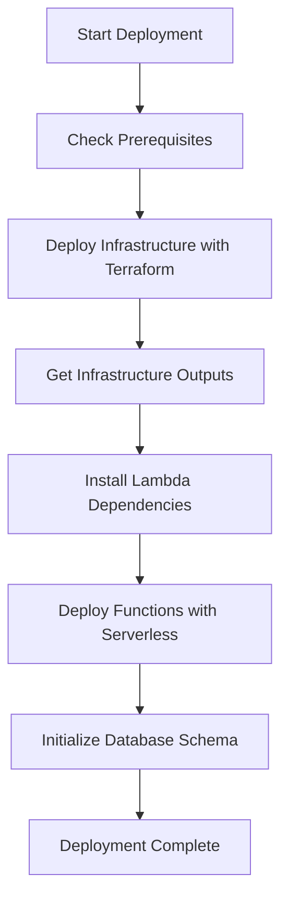
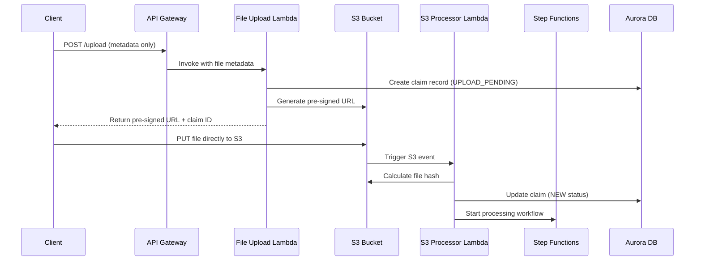

# ClaimIQ Architecture Documentation

## Infrastructure as Code Separation

Following the updated steering guidelines, we maintain a clear separation of concerns:

### Terraform (Infrastructure)
- **Purpose**: Defines "what exists"
- **Manages**: Core infrastructure resources that must exist before application deployment
- **Resources**:
  - VPC, subnets, security groups
  - Aurora Serverless v2 database
  - DynamoDB tables
  - S3 buckets
  - KMS keys and IAM roles
  - Basic API Gateway setup
  - CloudWatch log groups

### Serverless Framework (Application)
- **Purpose**: Defines "what runs"
- **Manages**: Lambda functions, API routes, event handlers, environment variables
- **Resources**:
  - Lambda function deployments
  - API Gateway routes and integrations
  - Step Functions state machines
  - Lambda permissions and triggers

## Lambda Runtime Decisions

### Node.js Functions

#### File Upload Function (`src/lambda/file_upload/index.js`)
**Runtime**: Node.js 18.x
**Justification**: 
- Primary use case: HTTP request handling, S3 uploads, database operations
- Excellent AWS SDK support
- Fast cold start times
- Simple I/O operations don't require specialized libraries
- Aligns with steering guideline: "Default choice is always Node.js"

**Key Operations**:
- API Gateway request parsing
- File validation (size, type)
- S3 object storage
- Aurora database operations
- DynamoDB logging

### Python Functions

#### Normalization Function (`src/lambda/normalization/lambda_function.py`)
**Runtime**: Python 3.11
**Justification**: **Python provides clear technical advantages for this use case**
- **Heavy PDF Processing**: Amazon Textract integration with complex document analysis
- **Data Science Libraries**: Potential need for pandas, numpy for Excel/CSV processing
- **OCR Libraries**: More mature document processing ecosystem (PyPDF2, pdfplumber, etc.)
- **Scientific Computing**: Better support for data transformation and analysis
- **Regex and Text Processing**: Superior libraries for pattern matching and text extraction

**Key Operations**:
- Amazon Textract document analysis
- Complex PDF text extraction and parsing
- CSV/Excel data processing
- Pattern matching for claim information extraction
- Data transformation and normalization

**Technical Requirements That Justify Python**:
1. **Document Processing**: Heavy use of Textract with complex response parsing
2. **Data Analysis**: Need for robust data manipulation libraries
3. **Text Processing**: Advanced regex and natural language processing
4. **Scientific Libraries**: Potential future need for ML/AI libraries

## Deployment Flow

### Step-by-Step Process

1. **Infrastructure First**: Terraform creates all core AWS resources
2. **Extract Outputs**: Get ARNs, IDs, and endpoints from Terraform
3. **Install Dependencies**: 
   - Node.js: `npm install` for file upload function
   - Python: `pip install -r requirements.txt` for normalization function
4. **Deploy Functions**: Serverless Framework deploys Lambda functions with proper configuration
5. **Database Setup**: Manual schema initialization (one-time setup)

## File Upload & Ingestion Standard Implementation

Following the updated steering guidelines, the system now implements S3 pre-signed URLs for file uploads:

### New Architecture Flow

### Key Benefits

1. **No API Gateway Payload Limits**: Files bypass API Gateway completely
2. **Reduced Latency**: Direct client-to-S3 upload
3. **Cost Optimization**: No Lambda compute time for file transfer
4. **Event-Driven Processing**: S3 events trigger processing automatically
5. **Better Reliability**: Native S3 upload reliability and retry mechanisms

### Implementation Details

**File Upload Lambda** (`src/lambda/file_upload/index.js`):
- **Purpose**: Generate pre-signed URLs for S3 uploads
- **Input**: File metadata (name, size, type, hash)
- **Output**: Pre-signed URL, claim ID, upload instructions
- **Database**: Creates initial claim record with `UPLOAD_PENDING` status

**S3 Processor Lambda** (`src/lambda/s3_processor/index.js`):
- **Purpose**: Process S3 upload events and trigger workflows
- **Trigger**: S3 bucket events (`ObjectCreated:*`)
- **Actions**: Calculate file hash, update claim status, start Step Functions
- **Error Handling**: Mark claims for manual review on processing failures

## Security Considerations

### Multi-Tenant Isolation
- **Database Level**: Row Level Security (RLS) policies
- **Storage Level**: S3 prefixes with tenant isolation
- **API Level**: Tenant ID validation in all requests
- **IAM Level**: Least privilege access for each function

### Data Protection
- **Encryption**: KMS encryption for all data at rest
- **Transit**: TLS 1.2+ for all data in transit
- **Secrets**: AWS Secrets Manager for database credentials
- **Audit**: Comprehensive logging in DynamoDB and CloudWatch

## Monitoring and Observability

### CloudWatch Integration
- **Logs**: Structured logging for all functions
- **Metrics**: Custom metrics for business operations
- **Alarms**: Automated alerting for failures
- **Tracing**: X-Ray tracing for request flow

### Operational Metrics
- File upload success/failure rates
- Processing times by file type
- Error rates by tenant
- Database performance metrics

## Cost Optimization

### Serverless Benefits
- **Pay-per-use**: No idle server costs
- **Auto-scaling**: Automatic capacity management
- **Resource Efficiency**: Right-sized memory allocation per function

### Storage Optimization
- **S3 Lifecycle**: Automatic transition to cheaper storage classes
- **Aurora Serverless**: Auto-scaling database capacity
- **DynamoDB**: On-demand pricing for variable workloads

## Future Considerations

### Scalability
- **Lambda Concurrency**: Configurable per function
- **Database Scaling**: Aurora Serverless v2 auto-scaling
- **API Gateway**: Built-in throttling and caching

### Extensibility
- **New Runtimes**: Easy to add specialized functions
- **Additional Services**: Terraform modules for new infrastructure
- **Integration Points**: Event-driven architecture supports new components

This architecture provides a solid foundation for the ClaimIQ system while maintaining flexibility for future enhancements and clear separation of concerns between infrastructure and application code.